# Part 1 — Project Overview & Complete System Architecture

Sections 1–2 of the SEVPS handover set. See [README.md](README.md) for the index.

## Contents

- [§1 Project Overview](#1-project-overview)
  - [1.1 Purpose](#11-purpose)
  - [1.2 The real-world problem](#12-the-real-world-problem)
  - [1.3 Objectives](#13-objectives)
  - [1.4 Main features](#14-main-features)
  - [1.5 Target users](#15-target-users)
  - [1.6 Scope — in and out](#16-scope--in-and-out)
  - [1.7 Future scalability](#17-future-scalability)
- [§2 System Architecture](#2-system-architecture)
  - [2.1 The six layers](#21-the-six-layers)
  - [2.2 Whole-system component diagram](#22-whole-system-component-diagram)
  - [2.3 Frontend architecture](#23-frontend-architecture)
  - [2.4 Backend architecture](#24-backend-architecture)
  - [2.5 Database architecture](#25-database-architecture)
  - [2.6 AI architecture](#26-ai-architecture)
  - [2.7 Computer Vision architecture](#27-computer-vision-architecture)
  - [2.8 GIS architecture](#28-gis-architecture)
  - [2.9 WebSocket architecture](#29-websocket-architecture)
  - [2.10 Authentication flow](#210-authentication-flow)
  - [2.11 Notification flow](#211-notification-flow)
  - [2.12 Deployment architecture](#212-deployment-architecture)
  - [2.13 Domain class diagram](#213-domain-class-diagram)

---

# §1 Project Overview

## 1.1 Purpose

SEVPS is a control-plane platform for **emergency vehicle priority in dense
urban traffic**. It tracks ambulances, fire engines, police and disaster
vehicles in real time; predicts how long they will take to reach their
destination given actual traffic; clears a path for them by pre-empting traffic
signals ahead of their arrival; warns the road users who are about to be in the
way; recommends a receiving hospital that can actually treat the patient; and
records everything that happened so the service can be measured and improved.

It is a **decision-support and actuation system**, not a mapping toy. It issues
commands to real traffic-signal controllers and it handles patient-identifying
data. Both facts drive design choices throughout: signal holds have hard safety
caps and automatic release; clinical fields are gated by role and redacted at
the serializer boundary; and every fan-out path is fail-soft so that a broken
WebSocket or push service can never abort a dispatch decision.

## 1.2 The real-world problem

The reference deployment is Chennai, but the problem is general to any dense
city:

**Ambulances lose most of their time at junctions, not on open road.** An
ambulance travelling 8 km in heavy traffic may spend more of its journey
stationary at signals than moving. Every minute matters clinically — the
survival curve for out-of-hospital cardiac arrest falls roughly 7–10 % per
minute without intervention, and stroke and major trauma have comparable
time-dependent outcomes.

Four specific failures compound:

1. **Drivers notice an ambulance far too late.** By the time a siren is audible
   over a closed car window, the driver is often already boxed in and cannot
   move aside. Warning them *before* the ambulance arrives is a different and
   much more tractable problem than making the siren louder.

2. **Signals do not know the ambulance is coming.** Fixed-time or
   vehicle-actuated signals treat an ambulance as one more car. Pre-empting the
   junction requires knowing *when* the vehicle will arrive, which requires a
   traffic-aware ETA, which requires live network state.

3. **Crews choose hospitals on habit and proximity.** The nearest hospital is
   frequently the wrong one. A cardiac arrest needs a catheterisation lab; a
   major trauma needs a designated trauma centre; a hospital on diversion needs
   to be excluded entirely. Getting this wrong costs a second transfer, which
   costs more time than the extra travel would have.

4. **Nobody measures any of it.** Without response-time distributions, corridor
   cost, and per-hospital routing agreement, a service cannot tell whether an
   intervention worked.

## 1.3 Objectives

| # | Objective | How it is met | Where |
|---|---|---|---|
| O1 | Know where every emergency vehicle is, continuously | GPS telemetry ingestion, dead-reckoning projection, staleness detection | `apps/fleet`, `apps/core/live.py` |
| O2 | Predict arrival honestly, including traffic | Time-dependent A*/Dijkstra over a live-weighted road graph, plus an ML residual correction | `apps/brain/router.py`, `apps/brain/ml` |
| O3 | Clear the path ahead of the vehicle | Corridor planning with per-junction clearance, safety-capped holds, automatic release | `apps/brain/corridor.py`, `apps/dispatch/corridor.py` |
| O4 | Warn road users in advance, not on arrival | Geohash-sharded alerts targeted *ahead* along the route, VMS boards, Web Push | `apps/alerts` |
| O5 | Route the patient to a hospital that can treat them | Interpretable weighted scoring against a clinical rule table, with hard capability filters | `apps/hospitals/recommender.py` |
| O6 | Match siren, lights and priority to actual severity | Four-level priority ladder with escalation triggers and an audit trail | `apps/dispatch/siren.py` |
| O7 | Never disclose clinical data to those who do not need it | Role-based redaction at the serializer, enforced over REST *and* WebSocket | `apps/core/permissions.py`, `apps/core/ws_policy.py` |
| O8 | Measure the service | Daily rollups, trend series, demand profiles, response-time distributions, CSV exports | `apps/analytics` |
| O9 | Run on a laptop and scale to a city | SQLite + in-memory channels by default; PostgreSQL/PostGIS + Redis + replicas by env var only | `sevps/settings.py`, `docker-compose*.yml` |

## 1.4 Main features

Numbered against the original problem statement (§4.1–4.11).

| Ref | Feature | Summary |
|---|---|---|
| 4.1 | **Real-time vehicle tracking** | GPS ingest at up to 1 Hz per vehicle, WebSocket fan-out, position projection between fixes, stale-vehicle detection |
| 4.2 | **Traffic-aware routing** | Time-dependent shortest path where edge cost depends on *arrival time at that edge*, not on departure-time weights |
| 4.3 | **Signal pre-emption / green corridor** | Junctions ahead of the vehicle are switched green with a computed clearance lead, capped hold, and automatic release once passed |
| 4.4 | **Dynamic rerouting** | Continuous reassessment against live congestion and road closures, with hysteresis so the route does not thrash |
| 4.5 | **Computer-vision traffic analysis** | Six detectors over camera frames: density, congestion, accident, road block, illegal parking, emergency-vehicle corroboration |
| 4.6 | **Driver alert system** | Advance warnings targeted at the cells the vehicle is *about to* enter, delivered by app, Web Push and roadside VMS |
| 4.7 | **Hospital preparedness** | Inbound-patient alerts with ETA, category and priority; acknowledgement and preparation notes |
| 4.8 | **AI traffic analytics** | Response-time statistics, corridor usage *and cost*, congestion and delay hotspots, demand profiles, trends |
| 4.9 | **Accident hotspot identification** | Spatial clustering of historical incidents into ranked blackspots |
| 4.10 | **Route optimisation with live conditions** | Congestion forecasting per segment per departure time, blocked-segment exclusion |
| 4.11 | **Emergency operations dashboard** | Single live picture: map, fleet, corridors, disruptions, event log |

## 1.5 Target users

Six roles, each a real job with different needs and different clearance.

| Role | Group name | Who they are | What they do here | Clinical access |
|---|---|---|---|---|
| **Administrator** | `administrators` | Platform owner / IT | Full administration, Django admin, rule catalogue, policy audit | Yes |
| **Traffic Police** | `traffic_police` (alias `operators`) | Traffic control room | Signal override, corridor release, road events, camera sweeps, hotspot analysis | **No — deliberately** |
| **Emergency Dispatcher** | `dispatchers` | 108/112 call centre | Opens responses, assigns vehicles, reassigns, cancels | Yes |
| **Ambulance Driver / Paramedic** | `ambulance_drivers` (alias `paramedics`) | Crew in the vehicle | Telemetry, patient assessment, hospital confirmation, stage changes | Yes |
| **Hospital Staff** | `hospital_staff` (alias `hospital`) | Receiving ED | Bed capacity, diversion status, acknowledging inbound patients | Yes |
| **Public User** | `public_users` | Registered road user | Receives driver alerts, reports incidents | No — and **no operational access either** |

Two of these deserve emphasis because they are the source of most of the
authorisation design:

**Traffic police have no clinical access.** A controller running a green
corridor needs the vehicle's priority level and position. They do not need the
patient's age or diagnosis, and giving it to them would be data collection
without purpose. This is data minimisation, not distrust.

**Public users are subjects of the platform, not operators of it.** A citizen
with a SEVPS account receives approaching-ambulance warnings and can report an
incident. They cannot see live fleet positions — that would disclose, in near
real time, which streets an ambulance was dispatched to.

Beyond the six roles there are two **credential-less consumers**, and Layer 4
depends on them working without an account:

- **Road users' phones** — subscribe to alerts by position, receive warnings.
- **Roadside VMS boards and city displays** — poll for their current message.

## 1.6 Scope — in and out

### In scope

- Live tracking, routing, ETA prediction and rerouting for emergency vehicles.
- Signal pre-emption against simulated and HTTP-addressable controllers.
- Hospital recommendation from an interpretable clinical rule table.
- Driver alerting by app, Web Push and roadside sign.
- Camera-derived traffic state (simulated by default, YOLOv8 when configured).
- Operational analytics, dashboards and CSV export.
- Six-role RBAC with clinical-data redaction.
- Containerised deployment with an Nginx edge.

### Explicitly out of scope

| Not included | Why |
|---|---|
| Computer-aided dispatch (call taking, resource allocation policy) | SEVPS consumes a dispatch decision; it does not make one. It integrates with a CAD, it is not one. |
| Electronic patient records | SEVPS holds the minimum clinical fields needed to route (category, age, deterioration flag, free-text notes). It is not an ePCR and must not become one. |
| Billing, rostering, fleet maintenance | Different products with different lifecycles. |
| Real traffic-signal safety certification | The controller adapter enforces caps and automatic release, but a municipal deployment requires certification against local signal standards. See Part 9. |
| Native mobile applications | The console is a responsive web app. The FCM adapter exists so a native Android driver app can be added without server changes. |
| Multi-city tenancy | The `city` field exists on the relevant models and the analytics honour it, but there is no tenant isolation, no per-city configuration, and no cross-city routing. |

## 1.7 Future scalability

The platform is deliberately built so that scaling is configuration, not
rewriting. Every one of these is a setting today.

| Dimension | Pilot default | Scaled | Mechanism |
|---|---|---|---|
| Database | SQLite (WAL) | PostgreSQL + PostGIS | `SEVPS_DB_ENGINE`, `SEVPS_ENABLE_POSTGIS` |
| Spatial queries | Bounding box + haversine in Python | Indexed `ST_DWithin` on generated `geography` columns with GiST | `apps/core/spatial.py` picks at runtime |
| Channel layer | In-memory (per-process) | Redis | `SEVPS_REDIS_URL` |
| Web tier | One process | N replicas behind Nginx | `SEVPS_WEB_REPLICAS`; no sticky sessions needed |
| Congestion model | Statistical baseline | scikit-learn HistGradientBoosting | Trained models land in `models/`; every estimator has a baseline fallback |
| Computer vision | Simulated detections | YOLOv8 + OpenCV | `SEVPS_CV_MODE=yolo` |
| Push | Web Push (VAPID) | + FCM for native clients | `SEVPS_FCM_CREDENTIALS` |
| Basemap | Keyless CARTO/OSM | + Mapbox styles and traffic tiles | `SEVPS_MAPBOX_TOKEN` |

**The one component that does not scale horizontally today** is the maintenance
worker, and that is intentional. It sweeps corridors and expires signal holds;
two instances would both decide a junction should be released and issue
duplicate commands to real infrastructure. Scaling it requires leader election
or partitioned assignment first. The constraint is pinned at `replicas: 1` in
both compose files and asserted by a test.

---

# §2 System Architecture

## 2.1 The six layers

The original problem statement specified six layers. They survive as the
organising principle, mapped onto Django apps:

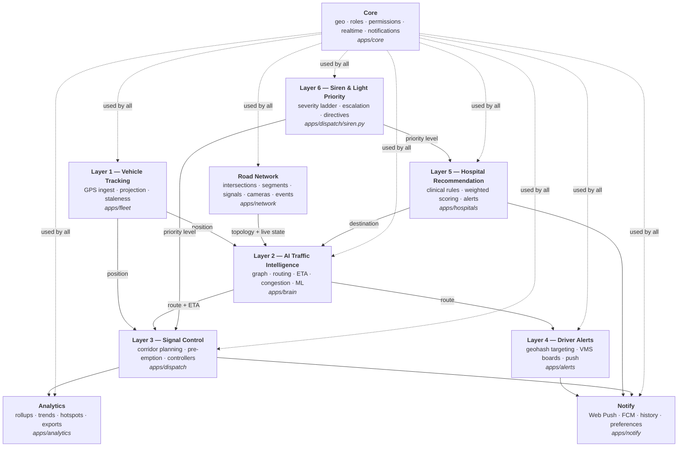

**Reading the arrows.** Layer 5 feeds Layer 2 rather than the reverse: the
hospital decision determines the destination, and only then is a route
computed. Layer 6 feeds both 3 and 5 because priority level changes what
corridor the trip is entitled to *and* how the hospital is scored.

## 2.2 Whole-system component diagram

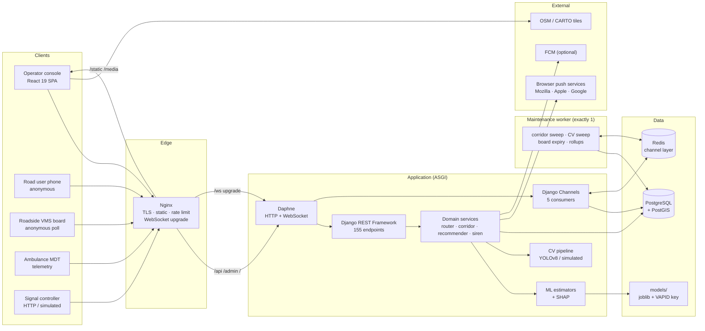

## 2.3 Frontend architecture

A single-page React 19 application in TypeScript, built by Vite, served in
production as static assets by Nginx with `index.html` returned by Django's
SPA catch-all.

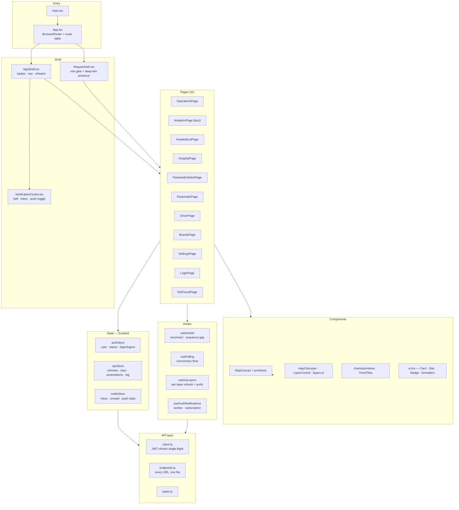

**Three decisions that shape everything else on the client:**

1. **Polling is the correctness floor; the socket is the latency win.** Every
   live screen polls its data on a slow interval *and* subscribes to a socket.
   If the socket dies, or if the deployment runs the in-memory channel layer
   where a worker's events never reach the web process, the console is stale by
   seconds rather than broken.

2. **The access token lives in module scope, never in storage.** It dies with
   the tab. Session restore on reload happens through the httpOnly refresh
   cookie, which JavaScript cannot read. There is consequently no "remember me"
   and no token in devtools' Application tab.

3. **Server-owned registries.** Both the GIS layer catalogue and the analytics
   series catalogue (label, unit, colour, direction) come from the server.
   Adding a layer or a metric is a server-side change; two screens cannot
   disagree about what a metric is measured in.

## 2.4 Backend architecture

Django 5.0 under ASGI (Daphne), ten application packages plus a config package.

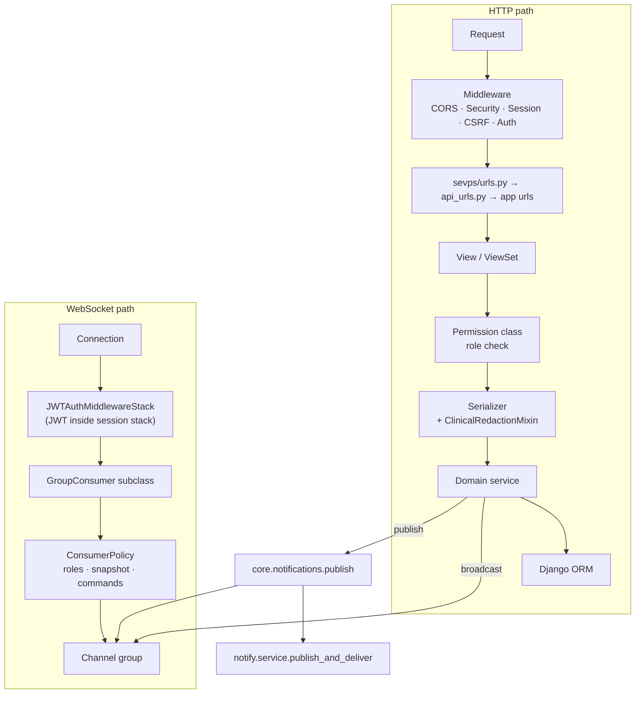

### Why ASGI rather than WSGI

Two hard requirements: WebSockets for the live dashboards (a control room that
learns about a corridor failure on the next 3-second poll is a control room
that learns too late), and an in-process background worker that does not need a
broker for a pilot install. Daphne serves both HTTP and WebSocket from one
process, so a municipal deployment is one service to run, not three.

### Layering rule

Views are thin. They resolve permissions, validate input through a serializer,
call a domain service, and serialise the result. **All behaviour lives in
services** — `orchestrator.py`, `corridor.py`, `recommender.py`, `router.py`,
`siren.py`. This is why the management commands (`simulate`, `sevps_worker`)
can drive the entire platform without going through HTTP at all: they call the
same services.

## 2.5 Database architecture

**Dual backend by design.** SQLite for zero-configuration pilots;
PostgreSQL + PostGIS for city-scale deployment. The switch is two environment
variables, and application code does not branch on it — `apps/core/spatial.py`
resolves the strategy once at runtime.

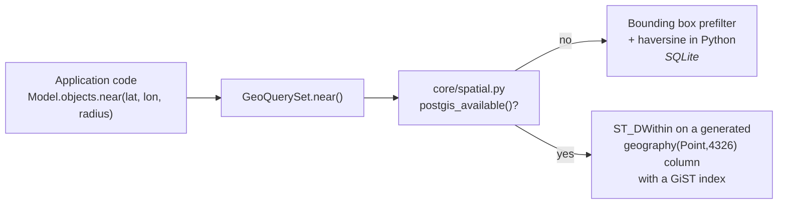

**PostGIS is reached through generated columns, not GeoDjango model fields.**
Every geo model stores plain `latitude`/`longitude` floats. Migration
`apps/core/migrations/0001_postgis_spatial_columns.py` adds, for each of 13
point tables, a `geom geography(Point,4326) GENERATED ALWAYS AS
(ST_MakePoint(longitude, latitude)::geography) STORED` column plus a GiST
index, and equivalent LineString columns for geometry tables.

The consequence, and the reason for the choice: **GDAL is not a runtime
dependency.** A GeoDjango `PointField` would require libgdal on every machine —
developer laptops, CI runners, and the container image. The generated-column
approach gets indexed spatial search with the plain `postgresql` backend.
`SEVPS_USE_GEODJANGO=1` opts into the GIS backend for those who want GeoDjango's
ORM expressions and have GDAL available.

**SQLite is configured for concurrency.** `apps/core/apps.py` hooks
`connection_created` and sets WAL journaling, `synchronous=NORMAL` and a
20-second busy timeout. Without this the simulator and the web process fight
over the file and the simulator dies with "database is locked".

## 2.6 AI architecture

Five estimators behind one uniform envelope. **Every prediction carries a
confidence and an explanation, and every estimator has a statistical baseline**
so the platform runs identically with no trained models present.

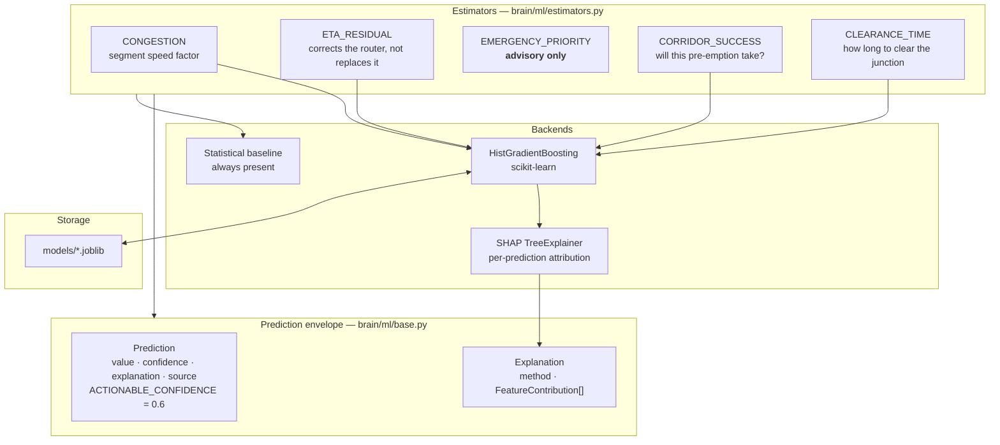

**The priority estimator is advisory and can never act alone.**
`predict_priority()` always returns the *rule-derived* level from
`apps/dispatch/siren.py` and records the model's disagreement separately. A
gradient-boosted tree does not get to decide that a cardiac arrest is Level 3.
The model's value is telling an operator that it disagrees with the rule — that
is a signal worth surfacing and never an action worth taking automatically.

**Deployment is gated.** `TrainingResult.should_deploy` requires the candidate
to beat its baseline by `MIN_IMPROVEMENT = 0.05` on held-out data. Features,
targets and baselines are split together in one `train_test_split` call — an
early version split them separately and compared error on *different rows*,
which made every model look excellent.

## 2.7 Computer Vision architecture

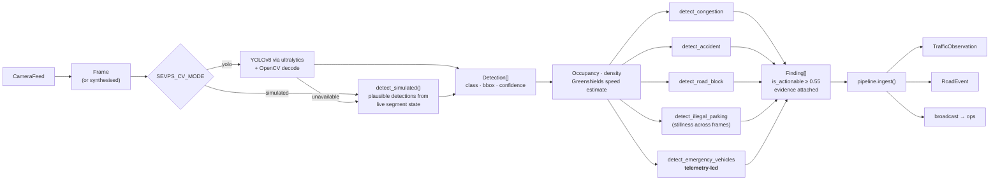

**Emergency-vehicle detection is telemetry-led with visual corroboration**, not
the reverse. The platform already knows exactly where its own fleet is. Asking
a camera "is that an ambulance?" and trusting the answer would produce false
corridors from any white van. Instead the fleet position seeds the hypothesis
and the camera raises or lowers confidence.

**Findings carry evidence.** A `Finding` is not a boolean; it holds the
detections, the derived measurements and the confidence that produced it, so an
operator reviewing "road blocked at TSC-114" can see why the system thinks so.

## 2.8 GIS architecture

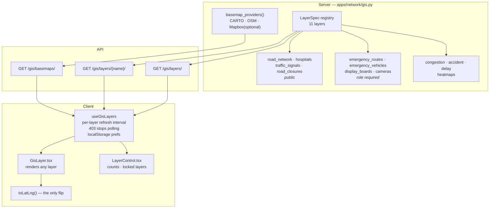

Routing runs on a **NetworkX-backed in-memory graph** with a two-tier cache:
topology (nodes and edges) at a 60-second TTL, live edge state (speed,
congestion, closure) at 5 seconds. Topology changes rarely and is expensive to
rebuild; live state changes constantly and is cheap.

**The search is custom rather than `networkx.astar_path`.** NetworkX's weight
callback receives `(u, v, data)` and cannot see accumulated travel time, so it
cannot express "this edge is slow *at the time you will arrive at it*" — which
is the entire point of time-dependent routing. NetworkX is still used for the
graph structure, connectivity checks and diagnostics.

## 2.9 WebSocket architecture

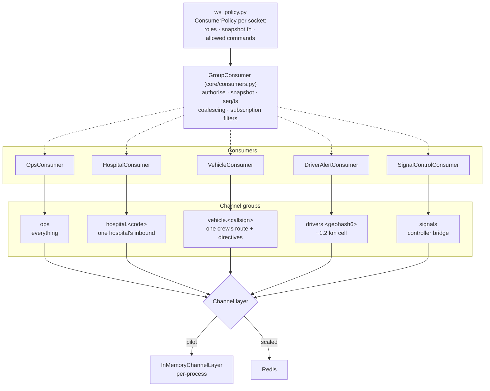

Four properties the base consumer provides to all five sockets:

- **Sequenced frames.** Every message carries `seq` and `ts`. A client that
  detects a gap knows it missed frames and refetches, rather than rendering a
  board that quietly stopped updating.
- **Coalescing.** `vehicle_position` is coalesced on `callsign` within a
  0.9-second window. Twenty vehicles at 1 Hz would otherwise be 20 frames per
  second per open dashboard.
- **Subscription filters.** A client can narrow what it receives without a
  separate socket.
- **Fail-closed authorisation.** `_authorise()` runs before groups are joined,
  and `self._groups = []` is initialised first so that a refusal cannot crash
  `disconnect()`.

## 2.10 Authentication flow

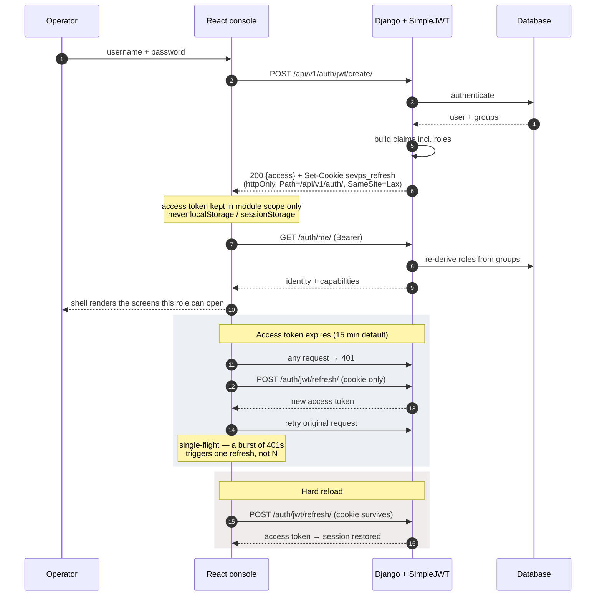

**Why `/auth/me/` re-derives roles from the database** rather than reading the
JWT claim: a role revoked mid-shift must take effect on the next call, not when
the token happens to expire.

## 2.11 Notification flow

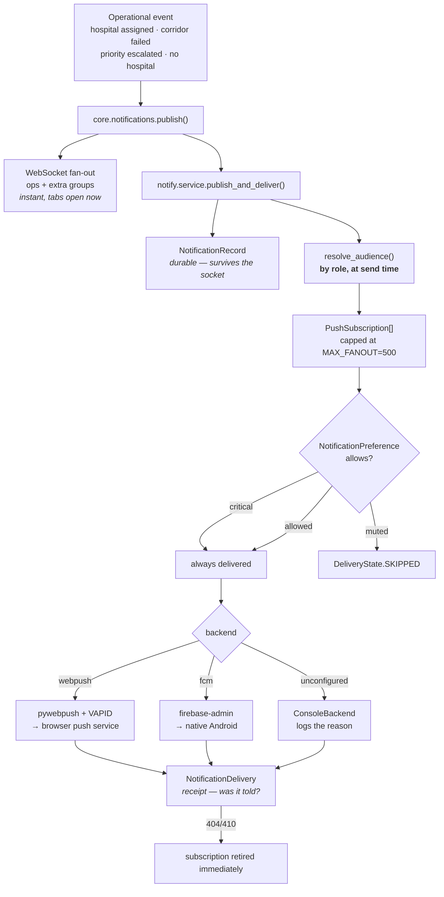

Three rules that are load-bearing:

- **Critical notifications ignore every preference.** A hospital cannot mute
  "inbound Level 1". Muting exists so the important messages stay visible.
- **Push payloads carry no clinical data.** The relay is a third party and the
  device may be unlocked. The payload says who, how urgent, and where to look.
- **404/410 retires a subscription at once.** That status is the push service
  stating the endpoint is gone; retrying it forever costs a doomed HTTPS
  request on every future fan-out.

## 2.12 Deployment architecture

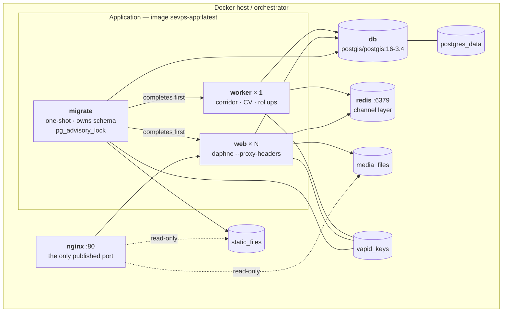

Compose is three files with a deliberate ordering:

| File | Loaded when | Contains |
|---|---|---|
| `docker-compose.yml` | always | Services, volumes, dependencies. **No host ports.** |
| `docker-compose.override.yml` | automatically, on a bare `docker compose up` | Host port publishing, `DEBUG=1` |
| `docker-compose.prod.yml` | only when named with `-f` | Nginx, `DEBUG=0`, required secrets, replicas, resource limits |

**The base file publishes nothing on purpose.** Compose skips the auto-override
whenever files are named explicitly, so a production deploy that forgets an
overlay comes up *unreachable* rather than coming up with an emergency
service's database on a public interface. A visible outage beats a silent
exposure.

## 2.13 Domain class diagram

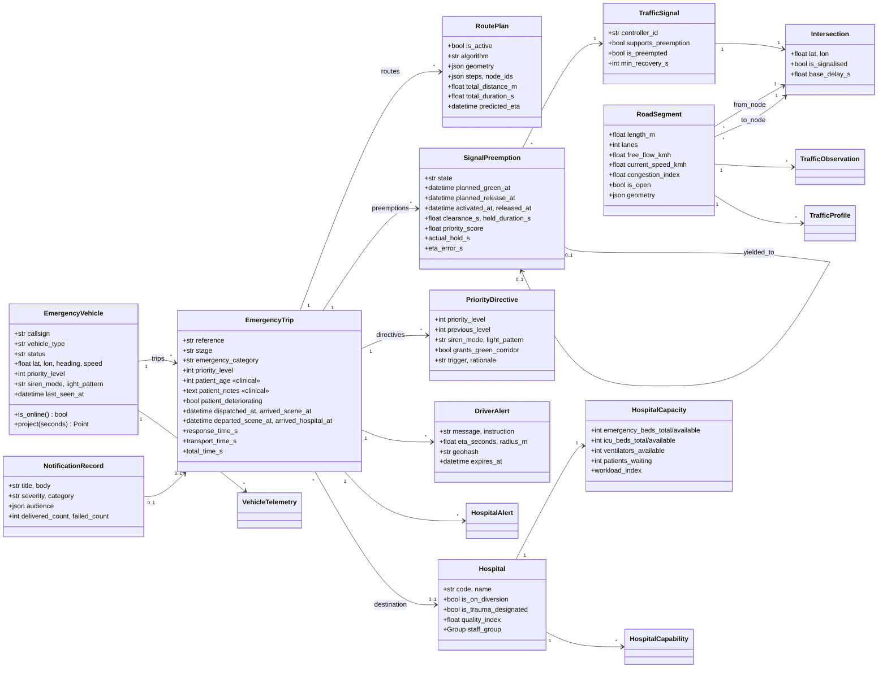

---

**Next:** [Part 2 — Technology Stack, Project Structure, Database](PART-2-STACK-STRUCTURE-DATABASE.md)
