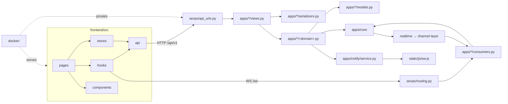

# Part 2 — Technology Stack · Project Structure · Database

Sections 3–5 of the SEVPS handover set. See [README.md](README.md) for the index.

## Contents

- [§3 Technology Stack](#3-technology-stack)
- [§4 Project Structure](#4-project-structure)
- [§5 Database Documentation](#5-database-documentation)

---

# §3 Technology Stack

Every runtime dependency, why it is here, and what it would take to replace it.
Version numbers are the pinned ones actually installed.

## 3.1 Backend — core framework

| Technology | Version | Purpose | Why chosen | Advantages | Alternatives considered | How it integrates |
|---|---|---|---|---|---|---|
| **Python** | 3.11 | Language | Ecosystem for geospatial, ML and web in one runtime; no second language for the AI layer | Mature ORM, scientific stack, readable domain logic | Go (fast, no ML ecosystem), Node (no scientific stack) | Everything under `apps/` |
| **Django** | 5.0.9 | Web framework, ORM, admin, migrations | An emergency platform needs an admin UI, a migration system and an auth system on day one. Building those is months of work with no differentiation | Batteries included; migrations are first-class; admin gives operations a data-editing surface for free | FastAPI (no ORM/admin/migrations), Flask (assemble everything) | `sevps/settings.py`; every app |
| **Django REST Framework** | 3.15.2 | REST API layer | Serializers, ViewSets, permission classes and content negotiation, all overridable | The permission-class mechanism is what makes the machine-checked policy audit possible | Django Ninja (Pydantic, less mature permissions), hand-rolled | Every `views.py`, `serializers.py`, `apps/core/permissions.py` |
| **Django Channels** | 4.1.0 | WebSocket / ASGI layer | Live dashboards cannot poll fast enough for corridor decisions | Group-based fan-out; same auth stack as HTTP; swap in-memory→Redis by config | Socket.IO (second runtime), SSE (no client→server) | `sevps/routing.py`, `apps/*/consumers.py`, `apps/core/realtime.py` |
| **Daphne** | 4.1.2 | ASGI server | Serves HTTP **and** WebSocket from one process | One service for a municipal deployment, not three | Uvicorn (+ a separate WS story), Hypercorn | `sevps/asgi.py`; `Dockerfile` CMD; listed first in `INSTALLED_APPS` so `runserver` becomes ASGI-aware |
| **asgiref** | 3.12.1 | Sync/async bridging | `async_to_sync`, `database_sync_to_async` | Lets synchronous domain services publish to async consumers | — | `apps/core/realtime.py`, `apps/core/consumers.py` |
| **sqlparse** | 0.5.5 | SQL formatting | Django dependency (`.query` display, debug) | — | — | Transitive |

## 3.2 Backend — auth, security, integration

| Technology | Version | Purpose | Why chosen | Advantages | Alternatives | Integration |
|---|---|---|---|---|---|---|
| **djangorestframework-simplejwt** | 5.3.1 | JWT issuance, refresh, blacklist | Stateless auth so the web tier scales without sticky sessions | Rotation + blacklist built in; claims are customisable | django-oauth-toolkit (OAuth2 overkill here), DRF Token (no expiry) | `apps/core/jwt.py`; `rest_framework_simplejwt.token_blacklist` in `INSTALLED_APPS` |
| **PyJWT** | 2.13.0 | JWT primitives | SimpleJWT dependency | — | — | Transitive |
| **django-cors-headers** | 4.4.0 | CORS | Dev console on :5173 talks to Django on :8000 | Per-origin control; production keeps same-origin | Manual middleware | First entry in `MIDDLEWARE` |
| **cryptography** | 50.0.0 | P-256 keygen, PEM handling | VAPID keypair generation and loading | Standard, audited | — | `apps/notify/vapid.py` |
| **python-dotenv** | 1.0.1 | `.env` loading | Twelve-factor config without a config server | Same file in dev and container | Manual `os.environ` | `sevps/settings.py` line 15 |
| **requests** | 2.32.3 | Outbound HTTP | HTTP traffic-signal controllers | Ubiquitous, timeout control | httpx (async, unused here) | `apps/dispatch/controllers.py` |
| **certifi** | 2026.7.22 | CA bundle | requests/pywebpush dependency | — | — | Transitive |

## 3.3 Backend — database

| Technology | Version | Purpose | Why chosen | Advantages | Alternatives | Integration |
|---|---|---|---|---|---|---|
| **SQLite** | bundled | Default database | A pilot must run with zero external services | No install; WAL gives usable concurrency | — | `SQLITE_CONFIG` in settings; WAL pragmas in `apps/core/apps.py` |
| **PostgreSQL** | 16 (image) | Production database | Concurrency, real indexes, PostGIS | Proven at city scale | MySQL (weaker spatial), MongoDB (relational data) | `postgres_config()`; `docker-compose.yml` |
| **PostGIS** | 3.4 (image) | Spatial indexing | Indexed radius search instead of full scans | `ST_DWithin` + GiST; KNN ordering | Plain geometry columns; H3 | `apps/core/spatial.py`; migration `0001_postgis_spatial_columns` |
| **psycopg** | 3.2.1 (+binary) | PostgreSQL driver | Current-generation driver | Better async story, faster COPY | psycopg2 (legacy) | Installed in the image, not in base requirements |

> **Note on GDAL.** SEVPS reaches PostGIS through *generated geography columns*
> and raw spatial SQL, not GeoDjango model fields. GDAL is therefore **not** a
> runtime dependency — a deliberate choice that keeps the image slim and CI
> simple. `SEVPS_USE_GEODJANGO=1` switches to the GIS backend for teams that
> want ORM spatial expressions and have GDAL available.

## 3.4 Backend — AI, ML and computer vision

| Technology | Version | Purpose | Why chosen | Advantages | Alternatives | Integration |
|---|---|---|---|---|---|---|
| **NetworkX** | 3.3 | Road graph structure | Mature graph library; the graph is ~10⁴ edges, well within pure-Python range | Connectivity, diagnostics, standard data structures | igraph (C, install friction), custom adjacency | `apps/brain/graph.py` |
| **scikit-learn** | 1.5.2 | Gradient-boosted estimators | `HistGradientBoostingRegressor/Classifier` handles tabular data with missing values and needs no GPU | Fast to train, easy to explain, deploys as one joblib file | XGBoost/LightGBM (extra deps), TensorFlow/PyTorch (wrong tool for tabular) | `apps/brain/ml/estimators.py` |
| **NumPy** | 2.1.3 | Numerics | sklearn/SHAP dependency; feature vectors | — | — | `apps/brain/ml`, `apps/network/cv` |
| **SciPy** | 1.17.1 | Scientific routines | sklearn/SHAP dependency | — | — | Transitive |
| **joblib** | 1.4.2 | Model persistence | sklearn's own format | Efficient array serialisation | pickle (unsafe), ONNX (overkill) | `models/*.joblib` |
| **SHAP** | 0.46.0 | Per-prediction attribution | An operational prediction that cannot say *why* is not actionable | `TreeExplainer` is exact and fast for tree models | LIME (slower, approximate), permutation importance (global only) | `apps/brain/ml/base.py` |
| **numba / llvmlite** | 0.66.0 / 0.48.0 | JIT | SHAP dependency | — | — | Transitive |
| **cloudpickle / slicer / tqdm / packaging** | — | Support | SHAP/sklearn dependencies | — | — | Transitive |
| **ultralytics (YOLOv8)** | *optional* | Object detection | Best accuracy-per-effort for vehicle detection; pretrained COCO classes cover car/bus/truck/motorcycle | One-line inference; runs on CPU | Detectron2 (heavier), custom CNN (needs labelled data) | `apps/network/cv/backends.py`, `SEVPS_CV_MODE=yolo` |
| **opencv-python-headless** | *optional* | Frame decode, image ops | Standard; headless avoids GUI deps in a container | — | Pillow (no video) | Same |

> Both CV packages are **commented out** in `requirements.txt`. Without them the
> pipeline runs in `simulated` mode, synthesising plausible detections from live
> segment state — which is what makes the CV tests deterministic and the default
> install small.

## 3.5 Backend — notifications

| Technology | Version | Purpose | Why chosen | Advantages | Alternatives | Integration |
|---|---|---|---|---|---|---|
| **pywebpush** | 2.3.0 | Web Push (RFC 8291) | **Primary** transport. W3C standard delivered by whichever push service the browser already uses | No vendor account; spreads outage risk across Mozilla/Apple/Google rather than one | Raw implementation (encryption is easy to get wrong) | `apps/notify/backends/webpush.py` |
| **py-vapid** | 1.9.4 | VAPID JWT signing | pywebpush dependency | — | — | Transitive |
| **http-ece** | 1.2.1 | Payload encryption | pywebpush dependency | Ciphertext through a third-party relay | — | Transitive |
| **firebase-admin** | *optional* | FCM | **Adapter only**, for native Android clients holding a registration token | Reaches a target Web Push cannot | — | `apps/notify/backends/fcm.py`, `SEVPS_FCM_CREDENTIALS` |

## 3.6 Backend — testing and tooling

| Technology | Version | Purpose | Why chosen | Integration |
|---|---|---|---|---|
| **pytest** | 9.1.1 | Test runner | Runs the existing 418 `TestCase` classes unchanged *and* adds parametrisation, fixtures and markers | `pytest.ini`, `conftest.py` |
| **pytest-django** | 4.12.0 | Django integration | `db` fixture, settings wiring, test database lifecycle | `DJANGO_SETTINGS_MODULE` in `pytest.ini` |
| **pytest-cov** | 7.1.0 | Coverage | Map of what has not been looked at | `.coveragerc` |
| **pytest-xdist** | 3.8.0 | Parallel execution | Optional; the suite is fast enough serially | — |
| **PyYAML** | 6.0.3 | YAML parsing | `apps/core/tests_deployment.py` parses the compose files so a published database port fails CI | Test-only |

## 3.7 Frontend

| Technology | Version | Purpose | Why chosen | Advantages | Alternatives | Integration |
|---|---|---|---|---|---|---|
| **React** | 19.0 | UI runtime | The console is highly stateful and live-updating; component model fits | Concurrent rendering; huge ecosystem | Vue, Svelte (smaller ecosystem for mapping) | `frontend/src/**` |
| **TypeScript** | 5.7 | Type system | Prevents a class of error that is otherwise found in production — a renamed serializer field | `strict` + `noUncheckedIndexedAccess` | JSDoc types (weaker) | `tsconfig.json` |
| **Vite** | 6.0 | Build tool & dev server | Instant HMR; proxies API and WebSocket so dev matches production origin semantics | Same-origin dev means the httpOnly refresh cookie just works | Webpack (slow), Parcel | `vite.config.ts` |
| **React Router** | 7.1 | Routing | Nested layouts, guards, deep-link preservation | Standard | TanStack Router | `src/app/App.tsx` |
| **Zustand** | 5.0 | State management | Small, hook-native, no provider tree | ~1 kB; selectors; no boilerplate | Redux Toolkit (ceremony), Context (re-render storms) | `src/stores/*` |
| **Leaflet** | 1.9.4 | Map engine | Mature, small, keyless with OSM tiles | Canvas rendering for thousands of polylines | MapLibre GL (vector tiles, heavier), Google Maps JS (licence) | `src/components/MapCanvas.tsx` |
| **react-leaflet** | 5.0 | React bindings | Declarative Leaflet | Lifecycle handled | Manual refs | Same |
| **Recharts** | 3.10 | Charts | React components rendering SVG; no imperative canvas lifecycle to keep in step with React | Inspectable, printable, accessible | Chart.js + react-chartjs-2 (canvas lifecycle bugs), D3 (build everything) | `src/components/charts/primitives.tsx`, lazy-loaded |

## 3.8 Frontend — build and test tooling

| Technology | Version | Purpose | Integration |
|---|---|---|---|
| **@vitejs/plugin-react** | 4.3 | JSX transform, Fast Refresh | `vite.config.ts` |
| **Vitest** | 2.1 | Unit tests | Separate `vitest.config.ts` — Vite 6 and Vitest 2 ship conflicting `Plugin` types, so merging the configs breaks `tsc` |
| **@testing-library/react / dom / jest-dom** | 16.1 / 10.4 / 6.6 | Component testing | `src/test/setup.ts` |
| **jsdom** | 25.0 | DOM for Vitest | Same |
| **@playwright/test** | 1.62 | End-to-end | `playwright.config.ts`; starts Django + Vite itself |
| **@types/react, react-dom, leaflet, node** | — | Type definitions | `tsconfig.json` |

## 3.9 Infrastructure

| Technology | Version | Purpose | Why chosen | Integration |
|---|---|---|---|---|
| **Docker** | — | Containerisation | One artifact from laptop to cloud | `Dockerfile` (4 stages) |
| **Docker Compose** | v2 | Local & single-host orchestration | Whole stack in one command | 3 compose files |
| **Nginx** | 1.27-alpine | Edge | TLS, static, WebSocket upgrade, rate limiting, absorbing slow clients | `docker/nginx/nginx.conf` |
| **Redis** | 7-alpine | Channel layer | Cross-process WebSocket fan-out | `SEVPS_REDIS_URL` |
| **channels-redis** | 4.2.0 | Redis channel backend | Installed in the image, not base requirements | Same |
| **Node** | 22-alpine | Frontend build stage | The image builds the console itself | `Dockerfile` stage 1 |
| **GitHub Actions** | — | CI | Five jobs, cheapest first | `.github/workflows/ci.yml` |

## 3.10 External services

| Service | Required? | Purpose | Fallback |
|---|---|---|---|
| CARTO / OpenStreetMap tiles | No key | Basemap | **This is the default**; no contract needed |
| Mapbox | Optional | Extra styles + live traffic tiles | Absent unless `SEVPS_MAPBOX_TOKEN` set |
| Google Maps | Config-only | Key read and reported, **not** rendered | See §12 for the recommendation |
| Browser push services | Automatic | Web Push delivery | Console backend logs what would have been sent |
| Firebase FCM | Optional | Native Android push | Not configured = normal |
| OSRM | Optional | External routing | SEVPS routes on its own graph |

---

# §4 Project Structure

## 4.1 Top level

```
SEVPS/
├── manage.py                     Django entry point
├── requirements.txt              Python dependencies, grouped with rationale
├── pytest.ini                    Test runner config + markers
├── conftest.py                   Shared pytest fixtures (repo root = importable)
├── .coveragerc                   Coverage config; deliberately no fail_under
├── .env.example                  Every environment variable, documented
├── .dockerignore                 Keeps the DB, node_modules and dist out of the image
├── .gitignore
├── Dockerfile                    4-stage build (frontend → base → deps → runtime)
├── docker-compose.yml            Base — no host ports
├── docker-compose.override.yml   Local — auto-loaded, publishes ports
├── docker-compose.prod.yml       Production — nginx, DEBUG off, replicas
├── README.md
│
├── sevps/                        Django project configuration package
├── apps/                         Ten application packages
├── frontend/                     React console + E2E suite
├── docker/                       Entrypoint and Nginx configuration
├── templates/                    Legacy server-rendered screens
├── static/                       Legacy CSS + the push service worker
├── models/                       Trained models + VAPID private key (gitignored)
├── migration/                    Data dumps for the PostgreSQL cutover
├── docs/                         Subject documentation
└── .github/workflows/ci.yml      Continuous integration
```

### Why the root is shaped this way

- **`conftest.py` at the root**, not inside `apps/`, because pytest fixtures must
  be importable from any test module and the root is always on the path.
- **`static/js/sw.js`** rather than a Vite asset, because a service worker's
  scope cannot rise above its own URL. Under `/static/` it would control the one
  part of the site with no pages in it.
- **`models/` is gitignored** and mounted as a Docker volume. It holds the VAPID
  private key, and regenerating that invalidates every push subscription.

## 4.2 `sevps/` — configuration package

| File | Lines | Purpose |
|---|---|---|
| `settings.py` | ~430 | Single settings module. Environment-driven: SQLite↔PostgreSQL, in-memory↔Redis, DEBUG-gated production hardening. The `SEVPS` dict holds every domain tunable |
| `urls.py` | 18 | Root URLconf: `/admin/`, `/api/v1/`, then `apps.dashboards.urls` (which owns `/sw.js` and the SPA catch-all) |
| `api_urls.py` | ~50 | The whole v1 API surface in one file — health, info, auth, then one `include()` per app. Readable as an index |
| `asgi.py` | — | ASGI application: `ProtocolTypeRouter` combining HTTP with `JWTAuthMiddlewareStack(URLRouter(websocket_urlpatterns))` |
| `wsgi.py` | — | Retained for WSGI deployment; loses WebSockets |
| `routing.py` | 24 | The five WebSocket routes, all under `/ws/` |

**Why `api_urls.py` is separate from `urls.py`:** the API surface is the
contract with every client. Keeping it in one file means "what does this
platform expose" is answerable by reading fifty lines.

## 4.3 `apps/` — application packages

| Package | Files | Lines | Layer | Owns |
|---|---|---|---|---|
| `core` | 38 | 6,443 | cross-cutting | Geo maths, roles, permissions, JWT, realtime, notifications, spatial abstraction, policy audits, base models, management commands |
| `brain` | 26 | 4,327 | Layer 2 | Graph, routing, ETA, corridor planning, priority scoring, congestion forecasting, rerouting, the ML package |
| `network` | 25 | 3,684 | infrastructure | Intersections, segments, signals, cameras, observations, road events, accidents, the CV package, the GIS layer registry |
| `dispatch` | 16 | 2,926 | Layers 3 & 6 | Trips, route plans, pre-emptions, directives, the orchestrator, corridor execution, controllers, siren policy |
| `notify` | 21 | 2,508 | cross-cutting | Push subscriptions, notification history, delivery receipts, preferences, Web Push and FCM backends, VAPID |
| `analytics` | 13 | 2,160 | 4.8 / 4.9 | Daily rollups, hotspots, response statistics, trend series, demand profiles, CSV exports |
| `hospitals` | 13 | 1,833 | Layer 5 | Hospitals, capability, capacity, clinical rules, the recommender, hospital alerts, recommendation audit |
| `alerts` | 13 | 1,023 | Layer 4 | Display boards, driver devices, driver alerts, the alert dispatcher |
| `fleet` | 9 | 651 | Layer 1 | Stations, emergency vehicles, telemetry |
| `dashboards` | 9 | 550 | UI | Legacy server-rendered screens, the SPA catch-all, `/sw.js`, the ops consumer |

### Standard layout inside an app

```
apps/<name>/
├── __init__.py
├── apps.py            AppConfig; occasionally signal wiring (core)
├── models.py          ORM models
├── serializers.py     DRF serializers, incl. clinical redaction
├── views.py           ViewSets and APIViews — thin
├── urls.py            Router registration + explicit paths
├── admin.py           Django admin registration
├── consumers.py       WebSocket consumers (where applicable)
├── <domain>.py        Domain services — the actual behaviour
├── migrations/
├── management/commands/
└── tests*.py
```

**The rule that keeps this maintainable:** views orchestrate, services decide.
`views.py` resolves permissions, validates, calls a service, serialises. That is
why `manage.py simulate` can drive the entire platform without HTTP — it calls
the same services the API does.

## 4.4 `apps/core/` in detail

The one package every other package imports. Worth listing file by file.

| File | Purpose |
|---|---|
| `geo.py` | Haversine, bearing, destination point, bounding box, polyline projection, geohash encode/neighbours. **Zero dependencies** — pure maths, so it is trivially testable and usable anywhere |
| `roles.py` | The six-role registry. `Role` constants, `RoleSpec` metadata, `ALIASES` for legacy group names, `user_roles()`, `has_role()`, `group_names_for()`, `OPERATIONAL_ROLES`, `CLINICAL_ROLES`, `TRAFFIC_ROLES`, `DISPATCH_ROLES` |
| `permissions.py` | Every DRF permission class. `BaseRolePermission` and its subclasses; `PublicRead`, `PublicDeviceRegistration`; backward-compatible `IsOperator` |
| `jwt.py` | Token serializers with role claims, the httpOnly refresh cookie (`sevps_refresh`, scoped to `/api/v1/auth/`), cookie-aware refresh |
| `ws_auth.py` | `JWTAuthMiddlewareStack` — **order matters**: JWT inside the session stack, or the session middleware overwrites an authenticated JWT scope with `AnonymousUser` |
| `ws_policy.py` | `ConsumerPolicy` per socket: allowed roles, snapshot function, permitted commands. Makes socket authorisation reviewable in one file |
| `consumers.py` | `GroupConsumer` base: authorisation, snapshot on connect, sequencing, coalescing, subscription filters, viewer identity |
| `realtime.py` | Thin wrapper over the channel layer. `broadcast`, `broadcast_ops`, `broadcast_many`, group-name helpers. **Never raises** |
| `notifications.py` | `Notification` dataclass, `publish()`, and one function per operationally important message so wording and audience are decided once |
| `live.py` | Worker ticks: `tick_etas`, `tick_traffic`, `tick_fleet_health`, `tick_all` |
| `spatial.py` | The dual-backend spatial abstraction; `postgis_available()`, `near_queryset()`, generated-column SQL, `spatial_status()` |
| `models.py` | `TimeStampedModel`, `UUIDModel`, `GeoPointModel`, `GeoQuerySet` |
| `api_policy.py` | `PUBLIC_READ_ENDPOINTS` allowlist with written reasons; `audit_api_permissions()` walks the live URLconf |
| `enums.py` | Every `TextChoices`/`IntegerChoices` in the domain |
| `routers.py` | `SEVPSRouter` — DRF router with a documented root view |
| `auth_views.py` | `WhoAmIView`, `RoleCatalogueView`, `AccessPolicyView`, `LogoutView` |
| `views.py` | `HealthView`, `LivenessView`, `ReadinessView`, `ServiceInfoView` |
| `apps.py` | `connection_created` signal → SQLite WAL pragmas |
| `context_processors.py` | Map centre/zoom for the legacy templates |

## 4.5 `frontend/`

```
frontend/
├── package.json           7 runtime deps, 13 dev deps
├── vite.config.ts         Proxy (configurable target), manual chunks, base path
├── vitest.config.ts       Separate — Vite 6 / Vitest 2 type conflict
├── playwright.config.ts   Starts Django + Vite; own database; Windows host fixes
├── tsconfig.json          strict, noUncheckedIndexedAccess, @/ alias
├── index.html
├── e2e/                   4 files — fixtures + auth, operations, analytics specs
└── src/
    ├── main.tsx           createRoot
    ├── api/               client.ts · endpoints.ts · types.ts
    ├── app/               App.tsx · AppShell.tsx · RequireAuth.tsx
    ├── pages/             11 route components
    ├── components/        MapCanvas · NotificationCentre · NotificationSettings · ui
    │   ├── map/           GisLayer · LayerControl · layers.ts
    │   └── charts/        primitives.tsx · TrendTiles.tsx
    ├── hooks/             useSocket · usePolling · useGisLayers · usePushNotifications
    ├── stores/            authStore · opsStore · notifyStore
    ├── lib/               push.ts
    ├── styles/            sevps.css
    └── test/              setup.ts
```

## 4.6 Interactions between folders



**One-directional rules that hold throughout:**

- `apps/core` imports **no** other SEVPS app at module level. Where it needs one
  (e.g. push fan-out inside `publish()`), the import is local and wrapped.
- Domain services may import models and `core`. They do not import views.
- Serializers do not call services. Views compose the two.
- The frontend never builds a URL outside `api/endpoints.ts`.

---

# §5 Database Documentation

## 5.1 Migration strategy

| Aspect | Approach |
|---|---|
| Tool | Django migrations, one numbered chain per app |
| Ownership | The `migrate` compose service, alone. `web` migrates in the single-replica default; `worker` **never** does |
| Concurrency | `pg_advisory_lock(87310219)` in `docker/entrypoint.sh` — Django has no internal lock, and concurrent replicas can half-apply |
| PostGIS | `apps/core/migrations/0001_postgis_spatial_columns.py` — creates the extension, adds generated columns and GiST indexes. **No-op on SQLite** |
| SQLite→PostgreSQL | `manage.py migrate_to_postgres` (dump, load, verify) + `manage.py verify_migration` (row counts and spot checks) |
| Drift detection | `manage.py makemigrations --check --dry-run` in CI — a model change without a migration passes every test and fails on first deploy |

## 5.2 Abstract base models

| Model | Fields | Used by | Notes |
|---|---|---|---|
| `TimeStampedModel` | `created_at` (auto, indexed), `updated_at` (auto) | almost everything | `created_at` is indexed because every analytics window filters on it |
| `UUIDModel` | `uuid` (unique, indexed) | vehicles, trips, signals, road events, hospitals, alerts, notifications | A stable public identifier that does not disclose row counts |
| `GeoPointModel` | `latitude`, `longitude` (both indexed) | 13 models | Plain floats. The PostGIS `geom` column is *generated from* these |
| `GeoQuerySet` | — | vehicles, segments, road events, hospitals… | Provides `.near(lat, lon, radius_m)`, which dispatches to PostGIS or haversine |

## 5.3 Entity-relationship diagram

```mermaid
erDiagram
    STATION ||--o{ EMERGENCY_VEHICLE : "home_station"
    EMERGENCY_VEHICLE ||--o{ VEHICLE_TELEMETRY : "telemetry"
    EMERGENCY_VEHICLE ||--o{ EMERGENCY_TRIP : "trips (PROTECT)"

    EMERGENCY_TRIP ||--o{ ROUTE_PLAN : "routes"
    EMERGENCY_TRIP ||--o{ SIGNAL_PREEMPTION : "preemptions"
    EMERGENCY_TRIP ||--o{ PRIORITY_DIRECTIVE : "directives"
    EMERGENCY_TRIP ||--o{ DRIVER_ALERT : "driver_alerts"
    EMERGENCY_TRIP ||--o{ HOSPITAL_ALERT : "hospital_alerts"
    EMERGENCY_TRIP ||--o{ HOSPITAL_RECOMMENDATION_LOG : "recommendation_logs"
    EMERGENCY_TRIP ||--o{ VEHICLE_TELEMETRY : "trip"
    EMERGENCY_TRIP }o--o| HOSPITAL : "destination_hospital"
    EMERGENCY_TRIP ||--o{ NOTIFICATION_RECORD : "notifications"

    HOSPITAL ||--|| HOSPITAL_CAPACITY : "capacity_row"
    HOSPITAL ||--o{ HOSPITAL_CAPABILITY : "capabilities"
    HOSPITAL ||--o{ HOSPITAL_ALERT : "alerts"
    HOSPITAL }o--o| AUTH_GROUP : "staff_group"

    INTERSECTION ||--o{ ROAD_SEGMENT : "from_node"
    INTERSECTION ||--o{ ROAD_SEGMENT : "to_node"
    INTERSECTION ||--|| TRAFFIC_SIGNAL : "signal"
    INTERSECTION ||--o{ CAMERA_FEED : "cameras"
    INTERSECTION ||--o{ ACCIDENT_RECORD : "accidents"

    ROAD_SEGMENT ||--o{ TRAFFIC_OBSERVATION : "observations"
    ROAD_SEGMENT ||--o{ TRAFFIC_PROFILE : "profiles"
    ROAD_SEGMENT ||--o{ ROAD_EVENT : "events"
    ROAD_SEGMENT ||--o{ CAMERA_FEED : "cameras"
    ROAD_SEGMENT ||--o{ DISPLAY_BOARD : "display_boards"

    TRAFFIC_SIGNAL ||--o{ SIGNAL_PREEMPTION : "preemptions"
    SIGNAL_PREEMPTION }o--o| SIGNAL_PREEMPTION : "yielded_to"

    CAMERA_FEED ||--o{ TRAFFIC_OBSERVATION : "camera"
    DISPLAY_BOARD ||--o{ DRIVER_ALERT : "board"
    DRIVER_DEVICE ||--o{ PUSH_SUBSCRIPTION : "device"

    AUTH_USER ||--o{ PUSH_SUBSCRIPTION : "push_subscriptions"
    AUTH_USER ||--|| NOTIFICATION_PREFERENCE : "notification_preference"
    AUTH_USER }o--o{ NOTIFICATION_RECORD : "read_by"
    NOTIFICATION_RECORD ||--o{ NOTIFICATION_DELIVERY : "deliveries"
    PUSH_SUBSCRIPTION ||--o{ NOTIFICATION_DELIVERY : "deliveries"

    EMERGENCY_RULE {
        str category PK-unique
        json required_facilities
        json preferred_facilities
        int default_priority_level
        bool requires_icu
        int golden_window_min
        bool time_critical
    }
    DAILY_METRIC {
        date date
        str city
        int trips_total
        float avg_response_time_s
        float total_hold_seconds
    }
    HOTSPOT {
        str kind
        float latitude
        float longitude
        int incident_count
        float score
    }
```

## 5.4 Table reference

Field lists give name · type · constraint · purpose. Every table also carries
`created_at`/`updated_at` from `TimeStampedModel` unless noted.

### `fleet_station`

| Field | Type | Constraints | Purpose |
|---|---|---|---|
| `id` | BigAuto | **PK** | |
| `name` | Char(140) | | Display name |
| `code` | Char(24) | **unique** | Stable external identifier |
| `city` | Char(80) | default `Chennai` | Multi-city grouping |
| `address`, `contact_number` | Char | blank | Contact detail |
| `latitude`, `longitude` | Float | indexed | Location |

Ordering `["name"]`.

### `fleet_emergencyvehicle`

| Field | Type | Constraints | Purpose |
|---|---|---|---|
| `id` | BigAuto | **PK** | |
| `uuid` | UUID | unique, indexed | Public identifier |
| `callsign` | Char(32) | **unique**, indexed | The operational identity — "AMB-01" |
| `registration` | Char(24) | blank | Number plate |
| `vehicle_type` | Char | choices | ambulance / fire_engine / police / disaster |
| `operator` | Char(140) | blank | Operating agency |
| `home_station` | FK → Station | SET_NULL | Base |
| `status` | Char | choices, | available / dispatched / on_scene / transporting / out_of_service |
| `latitude`, `longitude` | Float | indexed, default 0 | Last known position |
| `heading_deg`, `speed_kmh`, `accuracy_m` | Float | | Last fix quality |
| `last_seen_at` | DateTime | null, indexed | Drives staleness detection |
| `priority_level` | PosSmallInt | choices 1–4 | Current Layer 6 level |
| `siren_mode` | Char | choices | off / wail / yelp / hi_lo |
| `light_pattern` | Char | choices | Beacon pattern |
| `is_als` | Bool | | Advanced Life Support capable |
| `crew_size` | PosSmallInt | default 2 | |
| `equipment` | JSON | default `[]` | Capability list |
| `device_token` | Char(255) | blank | Legacy push token |

Indexes: `(status, vehicle_type)`, `(latitude, longitude)`.
**Why `(status, vehicle_type)`:** "nearest available ambulance" is the single
hottest fleet query and filters on exactly those two columns before the
distance calculation.

### `fleet_vehicletelemetry`

Append-only GPS history. `vehicle` FK CASCADE, `trip` FK (nullable),
`latitude`, `longitude`, `speed_kmh`, `heading_deg`, `accuracy_m`,
`recorded_at` (indexed).
Indexes: `(vehicle, -recorded_at)`, `(trip, recorded_at)`.
Ordering `-recorded_at`. No `TimeStampedModel` — `recorded_at` is the truth.

### `network_intersection`

`osm_id` (BigInt, indexed, nullable), `name`, `city` (indexed),
`is_signalised` (Bool, indexed), `base_delay_s` (Float), `latitude`,
`longitude`. Index `(latitude, longitude)`.

### `network_roadsegment`

| Field | Type | Notes |
|---|---|---|
| `from_node`, `to_node` | FK → Intersection | CASCADE; `related_name` `outgoing` / `incoming` |
| `name` | Char(160) | |
| `road_class` | Char | motorway…residential |
| `length_m` | Float | Metres |
| `lanes` | PosSmallInt | Feeds clearance calculation |
| `free_flow_kmh` | Float | Uncongested speed |
| `geometry` | JSON | `[lat, lon]` pairs — **note the order** |
| `is_open` | Bool | indexed |
| `allows_contraflow` | Bool | Priority-1 only |
| `current_speed_kmh` | Float | null | Live |
| `congestion_level` | Char | free/light/moderate/heavy/blocked |
| `speed_updated_at` | DateTime | indexed — drives live-data decay |
| `congestion_index` | Float | 0–1, derived |

Indexes `(from_node, to_node)`, `(is_open, congestion_level)`.
**Unique constraint** on `(from_node, to_node)` — a directed edge appears once.

### `network_trafficsignal`

One-to-one with `Intersection`. `controller_id` (**unique**), `controller_type`,
`endpoint` (URL), `cycle_seconds`, `phase_plan` (JSON), `supports_preemption`,
`min_recovery_s` (default 45), `current_phase`, `is_preempted` (indexed),
`preempted_until`, `last_preempted_at`, `last_heartbeat`, `is_online` (indexed).

**`min_recovery_s` is a safety field**, not a tuning knob: a junction that was
just held green must return to normal timing for at least this long before it
can be pre-empted again, or cross traffic never clears.

### `network_camerafeed`, `network_trafficobservation`, `network_trafficprofile`

- **CameraFeed** — `name`, optional FK to intersection and segment,
  `stream_url`, `heading_deg`, `is_active`, `last_analysed_at`, position.
- **TrafficObservation** — append-only. `segment` FK, `observed_at` (indexed),
  `speed_kmh`, `vehicle_count`, `density`, `occupancy`, `congestion_level`,
  `source` (sensor/camera/probe/simulated), optional `camera` FK. Indexes
  `(segment, -observed_at)` and `(-observed_at)`.
- **TrafficProfile** — learned historical speed factor per
  `(segment, weekday, hour)`. **Unique constraint** on those three; index on the
  same. This is the table `learn_traffic_profiles` writes and the router reads
  for time-of-day expectations.

### `network_roadevent`, `network_accidentrecord`

- **RoadEvent** — `event_type` (indexed), optional `segment` FK, `description`,
  `severity` (0–1), `confidence`, `source`, `starts_at` (indexed), `ends_at`,
  `is_active` (indexed), `radius_m`, position, `uuid`. Index
  `(is_active, event_type)`.
- **AccidentRecord** — historical incidents for hotspot clustering.
  `occurred_at` (indexed), `severity` 1–5, optional `intersection` FK,
  `casualties`, `description`, position. Index `(latitude, longitude)`.

### `hospitals_hospital` and friends

- **Hospital** — `code` (**unique**, indexed), `name`, `city` (indexed),
  `address`, `phone`, `emergency_phone`, `is_active` (indexed),
  `is_trauma_designated`, `quality_index` (0–1), `is_on_diversion` (indexed),
  `diversion_reason`, `staff_group` FK → `auth.Group` (**optional multi-tenancy
  hook**), position, `uuid`. Index `(city, is_active)`.
- **HospitalCapability** — `hospital` FK, `facility` (choices, indexed),
  `is_available`, `unavailable_reason`, `units`, `notes`. **Unique constraint**
  `(hospital, facility)`.
- **HospitalCapacity** — one-to-one. `emergency_beds_total/available`,
  `icu_beds_total/available`, `ventilators_available`,
  `operation_theatres_free`, `patients_waiting`, `doctors_on_duty`,
  `reported_at`.
- **EmergencyRule** — the clinical rule table. `category` (unique),
  `display_name`, `required_facilities` (JSON), `preferred_facilities` (JSON),
  `default_priority_level`, `requires_icu`, `golden_window_min`,
  `time_critical`, `guidance`, `is_active`.
- **HospitalAlert** — inbound-patient notice. `hospital` FK, `trip` FK,
  `emergency_category`, `priority_level`, `eta`, `distance_remaining_m`,
  `message`, `acknowledged_at`, `acknowledged_by`, `preparation_notes`, `uuid`.
  Index `(hospital, -created_at)`.
- **HospitalRecommendationLog** — audit. `trip` FK, `emergency_category`,
  `recommended` FK, `chosen` FK, `override_reason`, `candidates` (JSON),
  `rule_snapshot` (JSON).

**Why the recommendation log stores a JSON snapshot** rather than FKs to
candidates: the decision must be reconstructable years later even after a
hospital's capability set has changed. A live join would show today's
capabilities, not the ones the decision was made on.

### `dispatch_emergencytrip`

The central table.

| Group | Fields |
|---|---|
| Identity | `reference` (**unique**, indexed), `uuid`, `vehicle` FK (**PROTECT**) |
| Lifecycle | `stage` (choices), `dispatched_at`, `arrived_scene_at`, `departed_scene_at`, `arrived_hospital_at`, `handover_at`, `cancelled_at`, `cancellation_reason` |
| Incident | `incident_latitude/longitude`, `incident_address`, `caller_number` «clinical» |
| Clinical | `emergency_category`, `patient_age` «clinical», `patient_notes` «clinical», `patient_deteriorating`, `condition_updated_at` |
| Destination | `destination_hospital` FK, `destination_latitude/longitude`, `hospital_was_overridden` |
| Priority | `priority_level`, `siren_mode`, `light_pattern`, `allow_contraflow` |
| Live | `eta`, `distance_remaining_m` |

Indexes `(stage, -created_at)`, `(destination_hospital, stage)`.
Derived properties: `response_time_s`, `transport_time_s`, `total_time_s`.

**`vehicle` is `PROTECT`, not `CASCADE`.** Deleting a vehicle must not silently
erase its response history — that history is the evidence base for the
analytics and for any incident review.

### `dispatch_routeplan`

`trip` FK, `is_active` (indexed), `algorithm`, `reason`, origin/destination
coordinates, `geometry` (JSON `[lat, lon]` pairs), `steps` (JSON), `node_ids`
(JSON), `total_distance_m`, `total_duration_s`, `computed_at` (indexed),
`predicted_eta`. Index `(trip, is_active)`.

Route plans are **append-only**: a reroute creates a new row and deactivates the
old one, so the sequence of decisions is preserved.

### `dispatch_signalpreemption`

| Field | Purpose |
|---|---|
| `trip`, `signal` | FKs, CASCADE |
| `state` | planned / armed / active / released / cancelled / failed |
| `planned_green_at`, `planned_release_at` | The plan |
| `activated_at`, `released_at` | What actually happened |
| `predicted_arrival_at`, `actual_arrival_at` | Feeds ETA-error analytics |
| `clearance_s`, `hold_duration_s` | Timing parameters |
| `priority_score` | Contention resolution input |
| `yielded_to` | **Self-FK** — stood down for a higher-priority pre-emption |
| `controller_response` | JSON audit of what the controller replied |

Indexes `(state, planned_green_at)`, `(trip, state)`.
Derived: `actual_hold_s`, `eta_error_s`.

**`yielded_to` being a relation rather than a state** is load-bearing and was
the source of a real bug in the analytics: reading `state` alone files a yielded
pre-emption as "cancelled", which renders as a fault when it is the contention
rule working correctly.

### `dispatch_prioritydirective`

Append-only audit of every Layer 6 decision. `trip` FK, `priority_level`,
`previous_level`, `siren_mode`, `light_pattern`, `grants_green_corridor`,
`trigger`, `rationale`, `issued_by`.

### `alerts_displayboard`, `alerts_driverdevice`, `alerts_driveralert`

- **DisplayBoard** — `code` (**unique**), `name`, `channel`, `facing_deg`,
  optional `segment` FK, `endpoint`, `is_active`, `current_message`,
  `message_expires_at`, position.
- **DriverDevice** — `device_id` (**unique**, indexed), `channel`,
  `push_token`, `geohash` (indexed), `heading_deg`, `speed_kmh`,
  `last_seen_at` (indexed), `is_active`, position. **Only the coarse geohash
  cell is used for delivery** — precise positions are kept only as long as they
  are useful for targeting.
- **DriverAlert** — `trip` FK, `channel`, optional `board` FK, `message`,
  `instruction`, `eta_seconds`, `radius_m`, `approach_bearing_deg`,
  `priority_level`, `geohash` (indexed), `expires_at` (indexed),
  `delivered_count`, position, `uuid`. Indexes `(trip, -created_at)`,
  `(geohash, expires_at)`.

### `analytics_dailymetric`, `analytics_hotspot`

- **DailyMetric** — one row per `(date, city)`. Trip counts, response-time
  aggregates (avg/median/p90), transport time, corridor counts, total hold
  seconds, ETA error, reroutes, driver alerts, hospital overrides. Written
  idempotently by `rollup_daily_metrics`.
- **Hotspot** — `kind` (accident/congestion/delay, indexed), `label`, optional
  `intersection` FK, `incident_count`, `score`, `window_days`, `details` (JSON),
  position.

### `notify_*`

- **PushSubscription** — `user` FK (**nullable** — anonymous road users),
  `backend` (webpush/fcm), `endpoint` (**unique**, TextField), `p256dh`,
  `auth`, `device` FK → DriverDevice, `geohash` (indexed), `user_agent`,
  `is_active` (indexed), `failure_count`, `last_success_at`,
  `last_failure_reason`. Indexes `(is_active, backend)`, `(user, is_active)`.
- **NotificationRecord** — `uuid`, `title`, `body`, `severity` (indexed),
  `category` (indexed), `audience` (JSON), `link`, `dedupe_key` (indexed),
  `context` (JSON), `trip` FK, `delivered_count`, `failed_count`, `read_by`
  (M2M → User). Indexes `(-created_at, severity)`, `(dedupe_key, -created_at)`,
  `(category, -created_at)`.
- **NotificationDelivery** — the receipt. `notification` FK, `subscription` FK,
  `state`, `backend`, `status_code`, `detail`, `latency_ms`. Index
  `(notification, state)`.
- **NotificationPreference** — one-to-one with User. `muted_categories` (JSON),
  `quiet_hours_start/end`, `push_enabled`.

**`endpoint` is unique because it is the browser's identity for a
subscription.** Without that, a user who reloads with permission already
granted collects a new row per reload and receives one copy of every
notification per reload.

## 5.5 Index rationale summary

| Index | Query it serves |
|---|---|
| `emergencyvehicle(status, vehicle_type)` | "nearest available ambulance" |
| `emergencyvehicle(latitude, longitude)` | Bounding-box prefilter on SQLite |
| `vehicletelemetry(vehicle, -recorded_at)` | Track playback, latest fix |
| `roadsegment(from_node, to_node)` + unique | Graph edge lookup |
| `roadsegment(is_open, congestion_level)` | Live network state rebuild (5 s TTL) |
| `trafficobservation(segment, -observed_at)` | Latest observation per segment |
| `trafficprofile(segment, weekday, hour)` + unique | Router's time-of-day lookup |
| `emergencytrip(stage, -created_at)` | Active-trip list, the hottest query |
| `emergencytrip(destination_hospital, stage)` | Hospital inbound board |
| `signalpreemption(state, planned_green_at)` | Corridor sweep: what is due |
| `driveralert(geohash, expires_at)` | Layer 4 delivery to a cell |
| `notificationrecord(-created_at, severity)` | Inbox |
| PostGIS GiST on `geom` | `ST_DWithin` radius search |

## 5.6 Constraints

| Constraint | Table | Protects |
|---|---|---|
| `unique(from_node, to_node)` | roadsegment | One directed edge per node pair |
| `uniq_hospital_facility` | hospitalcapability | A hospital cannot declare a facility twice |
| `unique(segment, weekday, hour)` | trafficprofile | One learned factor per time bucket |
| `unique` on `callsign`, `code`, `controller_id`, `device_id`, `reference`, `endpoint` | various | External identity |
| `PROTECT` on trip→vehicle | emergencytrip | Response history survives fleet changes |
| `CASCADE` on trip children | routes, preemptions, directives, alerts | A deleted trip leaves no orphans |
| `SET_NULL` on optional FKs | segment→event, board→alert, hospital→recommendation | Reference data can be removed without destroying history |

---

**Previous:** [Part 1 — Overview & Architecture](PART-1-OVERVIEW-AND-ARCHITECTURE.md)
**Next:** [Part 3 — Backend Documentation](PART-3-BACKEND.md)
