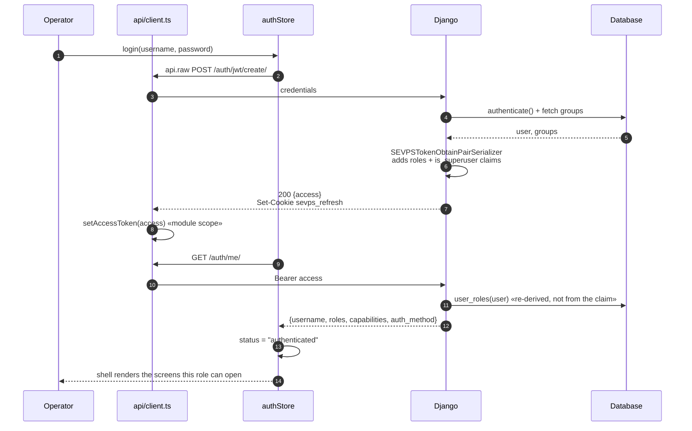
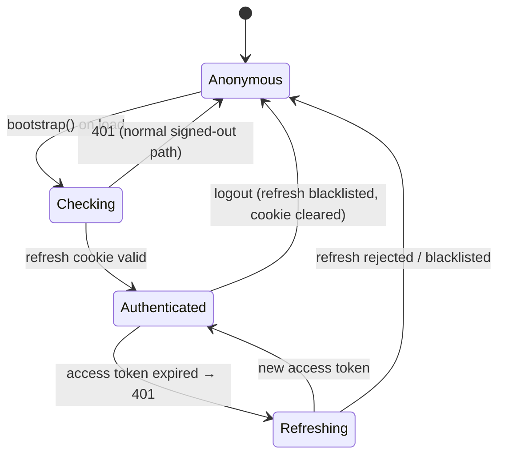
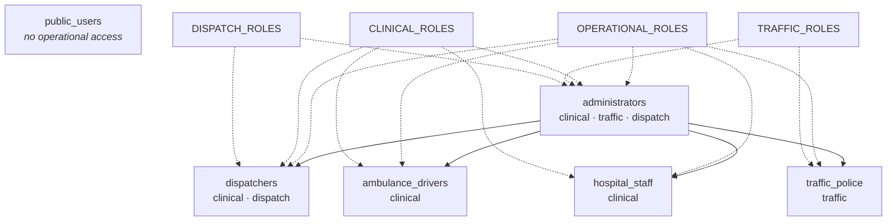
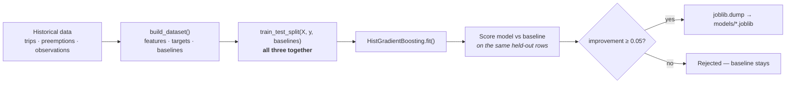
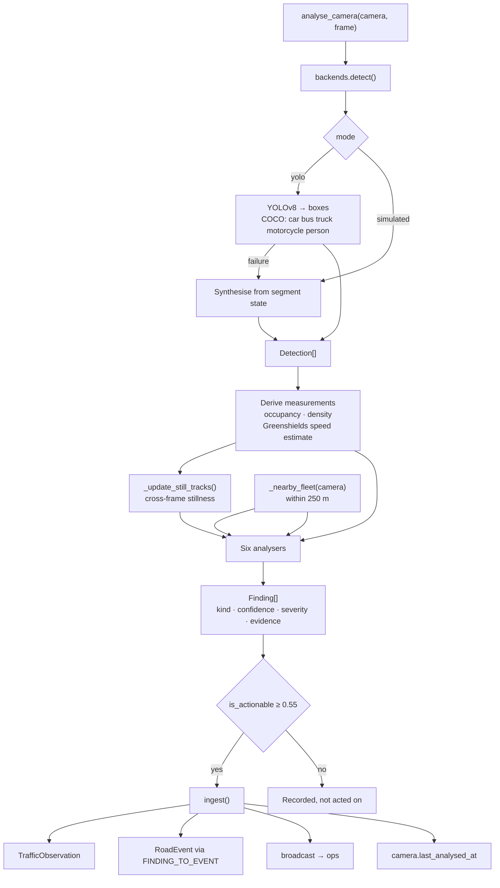
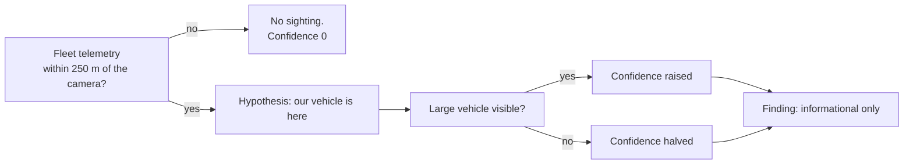
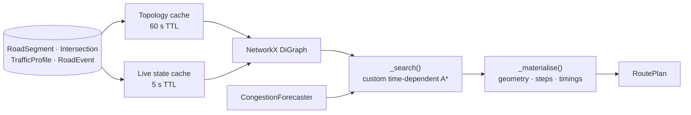

# Part 5 — Authentication · AI · Computer Vision · GIS (§9–12)

See [README.md](README.md) for the index.

## Contents

- [§9 Authentication & Authorisation](#9-authentication--authorisation)
- [§10 AI Module](#10-ai-module)
- [§11 Computer Vision](#11-computer-vision)
- [§12 GIS Module](#12-gis-module)

---

# §9 Authentication & Authorisation

## 9.1 The token strategy, and why

Two credentials with different lifetimes and different storage:

| Credential | Lifetime | Stored | Readable by JS | Purpose |
|---|---|---|---|---|
| **Access token** | 15 min (`SEVPS_JWT_ACCESS_MINUTES`) | **Module scope in `api/client.ts`** | yes, in memory only | Authorises every API call |
| **Refresh token** | 7 days (`SEVPS_JWT_REFRESH_DAYS`) | **httpOnly cookie** `sevps_refresh` | **no** | Mints new access tokens |

**Why the access token is never persisted.** `localStorage` is readable by any
script that executes on the page. An XSS in a dependency would exfiltrate a
durable credential to a platform that commands traffic signals and holds patient
data. In memory, it dies with the tab.

The consequences are visible and intentional: there is no "remember me"
checkbox, and there is no token in devtools' Application tab. The E2E suite
asserts this (`the access token is never written to browser storage`).

**Why the refresh cookie is path-scoped to `/api/v1/auth/`.** It is only ever
needed by the auth endpoints. Scoping means it is not attached to every request
to every endpoint, shrinking both the CSRF surface and the chance of it landing
in a proxy log.

| Cookie attribute | Value | Reason |
|---|---|---|
| `HttpOnly` | true | JS cannot read it |
| `Path` | `/api/v1/auth/` | Sent only where needed |
| `SameSite` | `Lax` | Blocks cross-site POST while allowing top-level navigation |
| `Secure` | true when `DEBUG=0` | Never over plain HTTP in production |

## 9.2 Login flow



**Why `/auth/me/` re-derives roles from the database** rather than trusting the
token claim: a role revoked mid-shift must take effect on the next call, not
whenever the token happens to expire. The claim exists so the client can render
its UI without a second round trip; the *authority* is always the database.

## 9.3 Token lifecycle



**Single-flight refresh.** A dashboard fires four polls plus a socket; when the
access token expires they all 401 at once. `refreshInFlight` in `client.ts`
ensures **one** refresh request, whose result every caller awaits. Without it,
five concurrent refreshes rotate the token four times and four of them fail.

**Rotation and blacklist.** `ROTATE_REFRESH_TOKENS` and
`BLACKLIST_AFTER_ROTATION` are on, so a used refresh token cannot be replayed.
`token_blacklist` is in `INSTALLED_APPS`; `/auth/jwt/logout/` blacklists
explicitly, which is why "back button after sign-out" cannot resurrect a
session.

**Logout is public.** Sign-out must succeed even when the access token has
already expired — otherwise a stale session cannot be ended.

## 9.4 RBAC — roles and hierarchy

There is **no strict hierarchy**. Roles are capability sets that overlap, because
the jobs overlap. Only `administrators` is a superset, and only because a
superuser implicitly holds every role.



**Traffic police are not below dispatchers; they are beside them.** A controller
can command signal infrastructure, which a dispatcher cannot. A dispatcher can
see a diagnosis, which a controller cannot. Neither is "higher".

## 9.5 Permission matrix

`✓` allowed · `—` denied · `R` read-only

| Capability | anon | public | police | hospital | crew | dispatch | admin |
|---|---|---|---|---|---|---|---|
| Health, info, role catalogue | ✓ | ✓ | ✓ | ✓ | ✓ | ✓ | ✓ |
| Public GIS layers (roads, hospitals, signals, closures) | R | R | R | R | R | R | R |
| Driver alerts near me · VMS boards | ✓ | ✓ | ✓ | ✓ | ✓ | ✓ | ✓ |
| Push subscribe / unsubscribe | ✓ | ✓ | ✓ | ✓ | ✓ | ✓ | ✓ |
| Hospital directory / recommend | R | R | R | R | R | R | R |
| **Live vehicles / trips / routes** | — | **—** | ✓ | ✓ | ✓ | ✓ | ✓ |
| **Analytics (all)** | — | **—** | ✓ | ✓ | ✓ | ✓ | ✓ |
| **Notification inbox / preferences** | — | **—** | ✓ | ✓ | ✓ | ✓ | ✓ |
| Own account (`/auth/me/`) | — | ✓ | ✓ | ✓ | ✓ | ✓ | ✓ |
| **Clinical fields** (age, notes, caller) | — | — | **—** | ✓ | ✓ | ✓ | ✓ |
| Push vehicle telemetry | — | — | — | — | ✓ | ✓ | ✓ |
| Patient assessment | — | — | — | — | ✓ | ✓ | ✓ |
| Hospital capacity / diversion | — | — | — | ✓ | — | — | ✓ |
| Acknowledge inbound | — | — | — | ✓ | — | — | ✓ |
| Open / cancel a response | — | — | — | — | — | ✓ | ✓ |
| Release a corridor · corridor tick | — | — | ✓ | — | — | — | ✓ |
| Signal heartbeat · speed ingest · clear events | — | — | ✓ | — | — | — | ✓ |
| CV sweep · hotspot recompute · graph rebuild | — | — | ✓ | — | — | — | ✓ |
| Clinical rule catalogue | — | — | — | — | — | — | ✓ |
| Policy audit (`/auth/policy/`) | — | — | — | — | — | — | ✓ |
| Django admin | — | — | — | — | — | — | ✓ |
| `/ws/signals/` (command traffic infrastructure) | — | — | ✓ | — | — | — | ✓ |

**This table is executable.** `apps/core/tests_rbac_matrix.py` runs 306
parametrised assertions across it. A change that alters who can do what fails
CI with the specific cell named.

## 9.6 Clinical redaction

The one place PHI is gated: `ClinicalRedactionMixin` in
`apps/dispatch/serializers.py`.

```python
class ClinicalRedactionMixin:
    CLINICAL_FIELDS = ("patient_age", "patient_notes", "caller_number")

    def to_representation(self, instance):
        data = super().to_representation(instance)
        if not may_view_clinical_data(self._viewer()):
            for field in self.CLINICAL_FIELDS:
                data[field] = None
            data["clinical_data_redacted"] = True
        return data
```

**It fails closed.** No serializer context → no viewer → redact. That default
surfaced three call sites that were not passing context, all of which would have
leaked. They are now covered by the RBAC matrix.

**It applies to the WebSocket too.** `HospitalConsumer` routes its snapshot
through the serializer rather than a bespoke payload builder. It previously used
`as_hospital_payload()`, which bypassed the mixin entirely — PHI over the socket,
found by probing the running server.

## 9.7 Password handling

- Django's default `PBKDF2PasswordHasher`, ~600,000 iterations, per-user salt.
- Four validators: user-attribute similarity, minimum length, common-password
  list, numeric-only.
- **Under pytest only**, `conftest.py` swaps in MD5. This took the RBAC matrix
  from over 20 minutes to 20 seconds. It applies only to the test session and
  nothing asserts hash strength.
- `seed_users` passwords are published in the source and the command says so.
  Change them before any reachable deployment.

## 9.8 The machine-checked policy

Two audits run as tests and fail the build:

| Audit | Fails on |
|---|---|
| `audit_api_permissions()` | An endpoint relying on DRF's global default, or public without an entry in `PUBLIC_READ_ENDPOINTS` |
| `ws_policy.policy_summary()` | A consumer with no declared `ConsumerPolicy` |

Plus `test_the_public_allowlist_has_no_stale_entries` — an allowlist entry for a
deleted endpoint is a permission waiting to be silently reused by the next thing
with that URL name.

## 9.9 Security defects found and fixed

Five, all found by probing a running server or by the RBAC matrix rather than by
reading code. Each now has a regression test.

| # | Defect | Impact | Fix |
|---|---|---|---|
| 1 | PHI readable **anonymously** over REST | Patient age and notes to anyone | `IsAuthenticatedRole` as the DRF default + `ClinicalRedactionMixin` |
| 2 | PHI over **WebSocket** | `/ws/hospital/` bypassed the serializer | Snapshot routed through the serializer + `HOSPITAL_POLICY` |
| 3 | `/ws/signals/` accepted **unauthenticated commands** | Anyone could command traffic signals | `SIGNALS_POLICY` restricted to traffic police |
| 4 | `IsHospitalStaff` required an unset group | **No hospital user could act at all** | Unset `staff_group` allows any hospital-role member |
| 5 | `public_users` could read **live ambulance positions** | Near-real-time disclosure of which streets got an ambulance | `OPERATIONAL_ROLES`; `IsAuthenticatedRole` requires one |

---

# §10 AI Module

## 10.1 Design principles

Three rules that shape every estimator:

1. **Every prediction carries a confidence and an explanation.** An operational
   prediction that cannot say *why* is not actionable. `ACTIONABLE_CONFIDENCE
   = 0.6`; below it, consumers are expected to fall back to the rule.
2. **Every estimator has a statistical baseline.** The platform runs identically
   with no trained models present, and every prediction reports `source` as
   `model` or `baseline`.
3. **A model advises; a rule decides.** Where a decision has clinical or safety
   consequence, the rule is authoritative and the model's disagreement is
   recorded as a signal.

## 10.2 The prediction envelope — `brain/ml/base.py`

```python
@dataclass
class FeatureContribution:
    feature: str
    value: float
    contribution: float          # signed SHAP value

@dataclass
class Explanation:
    method: str                  # "shap" | "baseline" | "rule_weighted"
    contributions: list[FeatureContribution]

@dataclass
class Prediction:
    value: float
    confidence: float
    source: str                  # "model" | "baseline"
    explanation: Explanation
    @property
    def actionable(self) -> bool:
        return self.confidence >= ACTIONABLE_CONFIDENCE
```

`SEVPSEstimator` is the base: `load()`, `predict()`, `explain()` (SHAP
`TreeExplainer`), `is_trained`, `baseline()`.

## 10.3 The five estimators

### 1. `CONGESTION` — segment speed factor

| | |
|---|---|
| **Task** | Regression: expected speed ÷ free-flow speed for a segment at a future time |
| **Input** | hour-of-day, weekday, road class index, lanes, length, historical profile factor, live factor, live-data age |
| **Output** | 0…1 speed factor |
| **Baseline** | The learned `TrafficProfile` for that `(segment, weekday, hour)` |
| **Consumed by** | `router.py` edge cost; `/brain/ml/congestion/` |

### 2. `ETA_RESIDUAL` — arrival correction

| | |
|---|---|
| **Task** | Regression on the **residual** — actual minus router-predicted seconds |
| **Input** | route distance, junction count, mean congestion, priority level, hour, weekday, corridor granted |
| **Output** | Seconds to add to the router's estimate |
| **Baseline** | Zero residual (trust the router) |
| **Consumed by** | `predict_eta(trip)`; `/brain/ml/eta/{trip_id}/` |

**It corrects the router, it does not replace it.** The router encodes the road
network and the corridor; the model learns the systematic error the physics
model does not capture. Replacing the router with a learned model would discard
everything known about the network for a function of aggregate features.

### 3. `EMERGENCY_PRIORITY` — **advisory only**

| | |
|---|---|
| **Task** | Classification over the four priority levels |
| **Input** | category index, patient age, deterioration flag, stage, time since dispatch |
| **Output** | Advisory level + probability |
| **Authority** | **None.** `predict_priority()` always returns the *rule* level and records `disagreement` separately |

A gradient-boosted tree does not get to decide a cardiac arrest is Level 3. The
model's value is telling an operator it disagrees with the rule — a signal worth
surfacing and never an action worth taking automatically.

### 4. `CORRIDOR_SUCCESS` — pre-emption likelihood

| | |
|---|---|
| **Task** | Binary classification: will this pre-emption activate and be used? |
| **Input** | seconds to arrival, congestion index, lanes, `supports_preemption`, controller type, recent failure rate, priority level |
| **Output** | Probability of success |
| **Consumed by** | Corridor planning (deprioritise unreliable junctions); `/brain/ml/corridor/{signal_id}/` |

### 5. `CLEARANCE_TIME` — how long to clear the junction

| | |
|---|---|
| **Task** | Regression on seconds of clearance needed |
| **Input** | congestion index, lanes, road class, approach length, hour |
| **Output** | Seconds |
| **Baseline** | `_clearance_for()` — the Greenshields-derived heuristic |
| **Consumed by** | `plan_corridor()` |

## 10.4 Hospital recommendation explanation

`explain_hospital_recommendation(recommendation)` returns an `Explanation` with
`method="rule_weighted"` — the actual weighted contributions of capability,
travel time, beds, workload and quality.

**Deliberately not SHAP.** The recommender is not a model; it is an
interpretable weighted sum. Wrapping it in SHAP would produce an approximation
of something already exact, and imply a learned model where there is none.

## 10.5 Training and deployment



**The split bug worth remembering.** An earlier version split features and
baselines in *separate* `train_test_split` calls, so the model's error and the
baseline's error were computed on **different rows**. Every model looked
excellent. Splitting all three in one call fixed it.

```bash
python manage.py train_models              # all estimators
python manage.py train_models --dry-run    # report, deploy nothing
python manage.py train_congestion_model
```

## 10.6 Model storage and inference

| Aspect | Detail |
|---|---|
| Location | `SEVPS_MODEL_DIR`, default `models/` |
| Format | joblib |
| Loading | Lazy, cached per process. Missing file → baseline, no error |
| Container | `models/` is a volume — models and the VAPID key survive replacement |
| Status | `GET /brain/ml/models/` reports which are trained |

**Inference pipeline:** build features → estimator loaded? → yes: predict +
SHAP-explain + confidence from tree variance; no: baseline + `method="baseline"`
→ wrap in `Prediction` → caller checks `.actionable`.

---

# §11 Computer Vision

## 11.1 Modes

| Mode | When | Behaviour |
|---|---|---|
| `simulated` | **default** | Synthesises plausible detections from live segment state — real congestion produces realistic occupancy |
| `yolo` | `SEVPS_CV_MODE=yolo` + packages installed | YOLOv8 inference over decoded frames |

The simulated mode is not a stub. It makes the CV tests deterministic, keeps the
default install small, and lets the whole downstream pipeline — findings, road
events, broadcasts — be exercised without a camera.

**YOLO falls back to simulated** if the model or packages are unavailable. A
missing weights file must not take the traffic pipeline offline.

## 11.2 Pipeline



## 11.3 Greenshields

Speed is inferred from occupancy using the Greenshields linear
speed–density relationship:

```
v = v_free × (1 − k / k_jam)
```

Chosen because it needs only one observable (density from occupancy) and one
calibration constant (jam density), both of which a camera can supply. More
sophisticated models need flow measurements a single frame cannot provide.

## 11.4 The six detectors

### `detect_congestion(occupancy, speed_ratio)`
Occupancy high **and** speed ratio low. Either alone is ambiguous: a full but
moving road is a busy road, and an empty slow road is a junction approach.

### `detect_accident(...)`
Stationary vehicles in an unusual arrangement plus a person detection in the
carriageway. **A person on the road is the strongest single signal** — that is
what distinguishes a crash from a jam.

### `detect_road_block(...)`
The carriageway is occupied but nothing is moving over multiple frames, with no
accident signature — construction, a breakdown, a flooded underpass.

### `detect_illegal_parking(...)`
Requires `PARKED_OBSERVATIONS = 3` consecutive still observations, **and**
requires surrounding traffic to be flowing. A still vehicle in a jam is a
vehicle in a jam. Severity stays minor: this is an enforcement nudge, not an
emergency.

### `detect_emergency_vehicles(...)` — telemetry-led



**The platform already knows where its own fleet is.** Asking a camera "is that
an ambulance?" and trusting the answer produces false corridors from any white
van. The fleet position seeds the hypothesis; the camera adjusts confidence. The
finding is **informational, never a road problem** — it does not create a
`RoadEvent`.

### `detect_congestion` → density
Vehicle count and occupancy feed `TrafficObservation`, which feeds the router.

## 11.5 Findings carry evidence

```python
@dataclass
class Finding:
    kind: str
    confidence: float
    severity: float
    detail: str
    evidence: dict          # detections, occupancy, speed ratio, stillness
    @property
    def is_actionable(self) -> bool:
        return self.confidence >= ACTIONABLE_CONFIDENCE   # 0.55
```

An operator reviewing "road blocked at TSC-114" can see the detections,
occupancy and speed ratio that produced it. A boolean would be unreviewable, and
an unreviewable automated road closure is one that gets switched off.

## 11.6 Running it

```bash
python manage.py analyse_cameras                 # whole estate
python manage.py analyse_cameras --camera 12
python manage.py sevps_worker                    # includes a periodic sweep
```
```
GET  /api/v1/network/cv/status/          public — backend + estate counters
POST /api/v1/network/cv/sweep/           traffic police
POST /api/v1/network/cameras/{id}/analyse/
GET  /api/v1/network/cv/emergency/       recent sightings
```

---

# §12 GIS Module

## 12.1 The layer registry

Eleven layers, declared once on the server.

| Layer | Geometry | Access | Refresh | Shows |
|---|---|---|---|---|
| `road_network` | LineString | public | 60 s | Roads coloured by live congestion |
| `hospitals` | Point | public | 30 s | Sites, capability, free beds, diversion |
| `traffic_signals` | Point | public | 10 s | Junctions and current hold state |
| `road_closures` | Point | public | 20 s | Blocking events |
| `emergency_routes` | LineString | role | 5 s | Planned corridors |
| `emergency_vehicles` | Point | role | 3 s | Live fleet |
| `display_boards` | Point | role | 30 s | VMS signs + current text |
| `cameras` | Point | role | 30 s | CV sites + last verdict |
| `congestion_heatmap` | Point | public | 30 s | Congested midpoints, weighted |
| `accident_heatmap` | Point | role | 300 s | Clustered blackspots |
| `delay_heatmap` | Point | role | 120 s | Junctions that lose corridor time |

**The catalogue is checked against enforcement.**
`test_catalogue_declares_permissions_matching_enforcement` fetches every layer
and asserts the advertised `public` flag matches the actual status code.

## 12.2 Coordinate order — the bug most likely to ship

GeoJSON is `[longitude, latitude]`. Leaflet is `[latitude, longitude]`. In
Chennai (13.06 N, 80.25 E) a swap places every feature at 80 N 13 E — the
Norwegian Sea. **The map does not error; it renders empty**, which reads as "no
data yet" rather than "wrong".

The rule: the server emits GeoJSON order, and **`toLatLng()` in
`components/map/layers.ts` is the only place that flips**. Four tests hold it,
including one that asserts longitude > latitude for Chennai.

Django models store `latitude`/`longitude` as separate floats and
`RoadSegment.geometry` as `[lat, lon]` pairs — the existing convention, kept.
`latlon_pairs_to_geojson()` converts at the boundary.

## 12.3 Routing and shortest path



**Time-dependent cost.** The cost of traversing edge *e* depends on the time the
vehicle *arrives at e*, not on departure-time weights:

```
t_arrive(e) = t_now + Σ traversal times so far
speed(e)    = free_flow(e) × forecaster.factor(e, t_arrive(e))
cost(e)     = length(e) / speed(e) + signal_delay(e, priority)
```

**Why `networkx.astar_path` cannot express this.** Its weight callback receives
`(u, v, data)` — no accumulated time. NetworkX provides the graph, connectivity
checks and diagnostics; the search is ours.

**Heuristic.** Straight-line distance ÷ maximum plausible speed — admissible, so
A* remains optimal. `MAX_EXPANSIONS = 250_000` bounds a pathological search; the
alternative to a bounded search is a request that never returns.

**A* vs Dijkstra** is selectable (`SEVPS_ROUTE_ALGORITHM`) and comparable at
`/brain/route/compare/` — useful for demonstrating that the heuristic does not
change the result, only the expansion count.

## 12.4 Heatmaps without a plugin

`leaflet.heat` was evaluated and **not adopted**: it renders a canvas blob with
no hit-testing, so an operator cannot click a hot cell to ask *why* — and "which
junction is this" is the only question a delay heatmap is asked. It also has no
React 19 bindings.

Heat surfaces are graduated `CircleMarker`s: radius and opacity scale with
`weight`, each keeps its popup.

Two deliberate choices in the builders:
- `congestion_heatmap` **omits free-flowing roads** — a heat surface covering
  every segment is a solid rectangle, which is not information.
- `accident_heatmap` reads the **pre-clustered** `Hotspot` table, so one
  junction is one cell rather than forty overlapping ones.

## 12.5 PostGIS

| Aspect | Implementation |
|---|---|
| Columns | `geom geography(Point,4326) GENERATED ALWAYS AS (ST_MakePoint(longitude, latitude)::geography) STORED` |
| Index | GiST per table |
| Tables | 13 point tables + LineString columns for geometry tables |
| Query | `ST_DWithin(geom, ST_MakePoint(%s,%s)::geography, %s)` |
| Fallback | Bounding box + haversine in Python |
| Selection | `apps/core/spatial.py`, resolved once and cached |
| **GDAL** | **Not required** |

Generated columns mean the application never writes `geom` — it cannot drift
from `latitude`/`longitude`, and no application code changes when PostGIS is
switched on.

## 12.6 Basemaps

| Provider | Key | Notes |
|---|---|---|
| CARTO Dark (OSM data) | none | **Default** |
| OpenStreetMap standard | none | |
| Mapbox Streets | `SEVPS_MAPBOX_TOKEN` | Appears only when set |
| Mapbox Traffic | `SEVPS_MAPBOX_TOKEN` | Vendor live-traffic tiles |

**The default must not require a key.** A platform that cannot draw a map
because a tile contract lapsed has failed at something more basic than mapping.

### Google Maps: configured, deliberately not rendered

`SEVPS_GOOGLE_MAPS_KEY` is read and reported in
`basemap_providers()["google_maps_available"]`, but Google is **not** offered as
a tile provider.

**Recommendation: do not integrate it as a basemap.** Google's terms require the
Maps JS API rather than raw `TileLayer` access, which means shipping a second
mapping runtime alongside Leaflet for a rendering result OSM already provides.
The genuine Google advantage is its **traffic and directions data**, not its
tiles — and SEVPS derives traffic from its own sensor, CV and telemetry
pipeline, which knows about held signals and closed roads that Google does not.

Where Google *would* add value is as a **fallback traffic source** for roads
with no sensor coverage. That belongs behind `SEVPS_TRAFFIC_PROVIDER` as a data
adapter, not as a basemap. The key is read and surfaced so that work needs no
settings change.

---

**Previous:** [Part 4 — Frontend & API](PART-4-FRONTEND-AND-API.md)
**Next:** [Part 6 — WebSockets, Notifications, Dashboards](PART-6-REALTIME-NOTIFICATIONS-DASHBOARDS.md)
