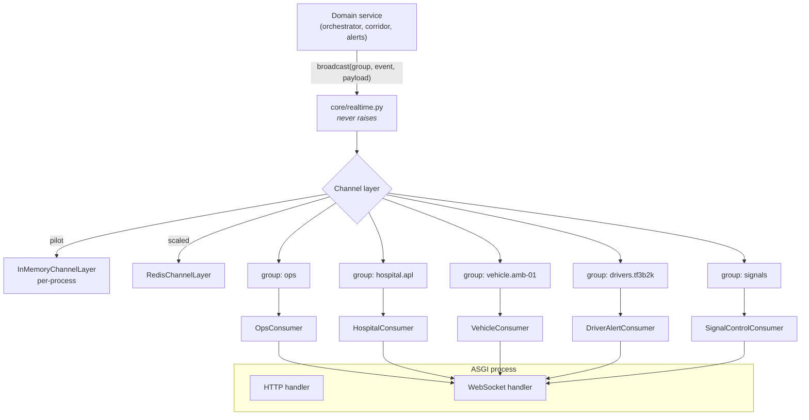
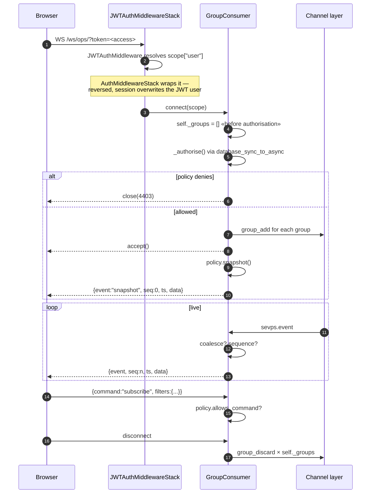
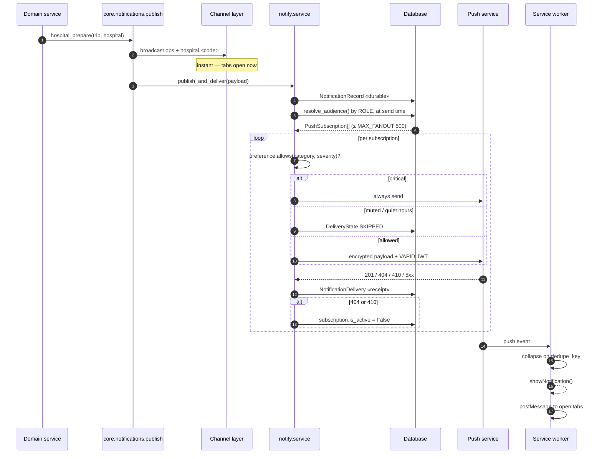

# Part 6 — WebSockets · Notifications · Dashboards (§13–15)

See [README.md](README.md) for the index.

## Contents

- [§13 WebSocket System](#13-websocket-system)
- [§14 Notifications](#14-notifications)
- [§15 Dashboards](#15-dashboards)

---

# §13 WebSocket System

## 13.1 Why WebSockets at all

A green corridor is a timing decision. A control room that learns about a
corridor failure on the next three-second poll learns after the ambulance has
already met the red light. Polling remains as the **correctness floor**; the
socket is the **latency win**.

Both run simultaneously, always. That is not redundancy for its own sake — the
default pilot deployment uses the in-memory channel layer, which is per-process,
so events raised by `sevps_worker` genuinely never reach a browser over the
socket. The polling fallback is what makes that deployment usable rather than
subtly broken.

## 13.2 Channels architecture



`realtime.py` is a thin wrapper with one hard rule:

```python
try:
    async_to_sync(layer.group_send)(group, message)
except Exception:
    log.warning("realtime fan-out failed ...", exc_info=True)
```

**A broken fan-out must never abort a dispatch decision.** The corridor is
already planned and the pre-emption already committed; failing to tell a
dashboard about it is a display problem, not an operational one.

## 13.3 Groups

| Group | Pattern | Members | Carries |
|---|---|---|---|
| `ops` | fixed | Every operations dashboard | Everything |
| `hospital.<code>` | per hospital | That hospital's screens | Inbound trips, ETA updates, acknowledgements |
| `vehicle.<callsign>` | per vehicle | That crew's screen | Route updates, priority directives, corridor state |
| `drivers.<geohash6>` | per ~1.2 km cell | Road users in the cell | Approaching-vehicle alerts |
| `signals` | fixed | Traffic-control screens and controller bridges | Pre-emption commands and state |

**Why geohash sharding for drivers.** A city-wide driver group would push every
alert to every device. Precision-6 geohash gives ~1.2 km cells; a vehicle warns
the cell it is entering plus its neighbours (`geohash_neighbours`), because a
vehicle near a boundary must warn both sides.

## 13.4 Connection lifecycle



Four details that were each a bug at some point:

- **`self._groups = []` is set before authorisation.** A refusal previously
  raised `TypeError` inside `disconnect()` because the attribute did not exist.
- **`_authorise()` wraps its role check in `database_sync_to_async`.** Reading
  `user.groups` in an async context otherwise raises `SynchronousOnlyOperation`.
- **The middleware nesting order is JWT *inside* session.** Reversed, every
  socket connects as `AnonymousUser` and dashboards silently degrade.
- **A snapshot is sent on connect.** Without it a client is blank until the next
  event, which during a quiet period could be minutes.

## 13.5 Message envelope

```json
{ "event": "vehicle_position", "seq": 1421,
  "ts": "2026-08-03T09:14:22.431+05:30",
  "data": { "callsign": "AMB-01", "latitude": 13.0604, "longitude": 80.2496 } }
```

| Field | Purpose |
|---|---|
| `event` | Discriminator; the client's handler map keys on it |
| `seq` | Monotonic per connection. **A gap means frames were missed** |
| `ts` | Server time — lets a client detect clock skew and staleness |
| `data` | Payload |

**Gap handling** is why `seq` exists:

```ts
onGap: () => { store.addLog("missed live frames - resyncing", "warn");
               void store.refreshAll(); }
```

Refetching beats rendering a board that quietly stopped updating. A dashboard
that is wrong but confident is worse than one that admits it and recovers.

## 13.6 Coalescing

```python
COALESCED_EVENTS = {"vehicle_position": "callsign"}
COALESCE_WINDOW_S = 0.9
```

Twenty vehicles reporting at 1 Hz is 20 frames per second per open dashboard.
Within the window only the **latest** position per callsign is sent — for a
position update, an intermediate frame has no value once superseded.

Deliberately **not** coalesced: `trip_stage`, `signal_preempted`,
`priority_directive`, `notification`. Those are events, not states; dropping an
intermediate one loses information.

## 13.7 Event catalogue

| Event | Group(s) | Raised by |
|---|---|---|
| `snapshot` | all | Consumer, on connect |
| `vehicle_position` | ops, vehicle | Telemetry ingest |
| `trip_created` | ops | `orchestrator.create_trip` |
| `trip_stage` | ops, vehicle, hospital | `orchestrator.advance_stage` |
| `hospital_assigned` | ops, vehicle, hospital | `orchestrator.assign_hospital` |
| `route_updated` | ops, vehicle | `orchestrator.apply_new_route` |
| `eta_update` | ops, vehicle, hospital | `live.tick_etas` |
| `priority_directive` | ops, vehicle | `siren.apply_priority` |
| `signal_preempted` / `signal_released` | ops, signals | `dispatch.corridor` |
| `driver_alerts` | ops | `alerts.dispatcher` |
| `driver_alert` | drivers.\<cell\> | `alerts.dispatcher` |
| `traffic_update` | ops | `live.tick_traffic` |
| `fleet_health` | ops | `live.tick_fleet_health` |
| `road_event_created` / `road_event_cleared` | ops | RoadEvent lifecycle, CV ingest |
| `display_boards_updated` / `_cleared` | ops | `alerts.dispatcher` |
| `notification` | ops + audience groups | `core.notifications.publish` |

## 13.8 Scaling

| Deployment | Layer | Consequence |
|---|---|---|
| Pilot | `InMemoryChannelLayer` | **Per-process.** Worker events never reach the web process; polling covers it. `/info/` reports this and the Settings screen warns |
| Production | `RedisChannelLayer` | Cross-process fan-out. `web` scales to N replicas |

**No sticky sessions are required.** The access token is held by the client and
validated by signature; there is no server-side session state to pin a
connection to. A dashboard connected to replica 2 receives an event raised by a
request served by replica 1, because the group lives in Redis.

**Nginx must be configured for it**, and the failure is quiet — see
[Part 8 §18](PART-8-DEPLOYMENT-TESTING-PERFORMANCE-SECURITY.md).

---

# §14 Notifications

## 14.1 The gap this closed

Before Phase 9 a notification was a WebSocket message and nothing else. Two
consequences, both bad for an emergency platform:

1. **No open tab, no notification.** A hospital away from the desk at 02:14 was
   never told about an inbound Level 1.
2. **No record.** Nobody could answer "was the hospital told?" — not at shift
   handover and not during an incident review.

## 14.2 Web Push primary, FCM adapter

The brief listed **FCM + Web Push**. The recommendation delivered and
implemented is **Web Push (VAPID) as the default, FCM as an optional adapter**.

| Reason | Detail |
|---|---|
| **Removes a single vendor from the delivery path** | Web Push is delivered by whichever service the *browser* already uses — Mozilla's for Firefox, Apple's for Safari, Google's for Chrome. With FCM as the transport, one vendor's outage takes alerting offline for everyone at once |
| **For browsers, FCM duplicates what exists** | FCM's web SDK wraps the same Web Push transport, plus a JS SDK, plus a Google Cloud project. The SEVPS console is a browser application |
| **Setup cost differs by an order of magnitude** | Web Push: `manage.py generate_vapid_keys`. FCM: a Google Cloud project, a Firebase app, a service-account key, a credentials file on every server |

**Where FCM genuinely wins** is the case Web Push cannot serve: a **native
Android driver app** holding an FCM registration token. That is a real target
for Layer 4, so the adapter exists and shares all the delivery, retry and
receipt machinery. Set `SEVPS_FCM_CREDENTIALS` and native tokens deliver
alongside browsers with no other change.

> **Verdict: integrate, do not replace.** Transport is chosen **per
> subscription row**, not globally.

## 14.3 Lifecycle



## 14.4 What is stored, and why

| Model | Answers | Why it exists |
|---|---|---|
| `PushSubscription` | *Where* a person can be reached | One row per browser/device. A controller with a desk machine and a phone has two |
| `NotificationRecord` | *What* was said | Survives the socket. Powers the inbox and any incident review |
| `NotificationDelivery` | *Whether it arrived* | A notification that silently failed is worse than one never sent — everyone believes it got through |
| `NotificationPreference` | *What someone opted out of* | A **mute list**, not a subscribe list |

**`endpoint` is unique because it is the browser's identity.** Without that, a
user who reloads with permission already granted collects a new row per reload
and receives one copy of every notification per reload.

**The endpoint is a bearer capability** — anyone holding it can push to that
browser — so it never leaves the server after registration. The subscriptions
API returns `endpoint_hint` (last 12 characters), enough to tell two devices
apart.

## 14.5 Audience — by role, never by user list

```python
Notification(audience=(Role.HOSPITAL, Role.DISPATCHER))
```

Resolved **at send time** through Django groups, so a nurse added this morning
is reached this afternoon with no resync. `group_names_for()` includes legacy
aliases, so a deployment still on the `operators` group keeps receiving
traffic-police alerts.

Three rules:

- **Empty audience = every operational role** — the same meaning it already had
  for the WebSocket fan-out.
- **It never includes anonymous devices.** A road user must not receive
  "corridor pre-emption failed at TSC-114". Driver alerts are a separate,
  geographic path.
- **Superusers receive everything**, matching `user_roles()`.

`MAX_FANOUT = 500` caps recipients. A city-wide hazard alert could otherwise
turn one API call into ten thousand inline HTTPS requests. **Truncation is
logged and reported** — silent truncation reads as "everyone was told".

## 14.6 Categories, preferences, and the rule that cannot be overridden

Severity says *how loud*; category says *what subject*. People mute by subject.

| Category | Raised by |
|---|---|
| `inbound_patient` | Hospital assignment |
| `corridor` | Pre-emption failure |
| `priority` | Escalation |
| `route` | Reroute |
| `dispatch` | No hospital available |
| `road_hazard` | Closures, driver alerts |
| `fleet` | Fleet health |
| `system` | Platform |

Existing call sites did not have to declare a category: `infer_category()`
derives it from the `dedupe_key` prefixes the notification helpers already set.

**Preferences are a mute list, not a subscribe list.** A category added by a
later release reaches everyone by default. A subscribe list fails silent, which
for operational alerting is the wrong direction.

### Critical alerts cannot be muted

```python
if severity == Severity.CRITICAL:
    return True   # before push_enabled, before categories, before quiet hours
```

A hospital cannot mute "inbound Level 1"; a controller cannot mute "corridor
failed". Muting exists so the important messages stay visible, not so they can
be switched off. The API states it (`critical_always_delivered: true`) and the
settings UI prints the rule — a checkbox that silently refuses to take effect is
worse than no checkbox.

## 14.7 Push payloads carry no clinical data

The relay is a third party and the device may be unlocked. The payload carries
only enough to decide whether to act: **who, how urgent, where to look.**

```json
{ "id": "…", "title": "Inbound cardiac arrest",
  "body": "AMB-3 en route to Apollo. Priority level 1.",
  "severity": "critical", "category": "inbound_patient",
  "link": "/hospital/APL", "dedupe_key": "inbound:412",
  "issued_at": "2026-08-03T02:14:09+05:30" }
```

`context` is dropped entirely — it holds trip internals, and on the
hospital-prepare path it carries patient identifiers. Two tests assert this,
including one for the anonymous road-user path.

## 14.8 The service worker

`static/js/sw.js`, served by Django at **`/sw.js`**.

**It must be at the root**: a service worker's scope cannot rise above its own
URL. Bundled as a Vite asset it would live under `/static/` and control
`/static/` — the one part of the site with no pages in it.

| Behaviour | Why |
|---|---|
| Collapses on `dedupe_key` | Three reroutes of one trip are one story. Without it a crew gets three banners and learns to swipe |
| `requireInteraction` for critical only | A Level 1 stays on screen until acted on |
| `postMessage` to open tabs | The in-app centre updates immediately, not at its next poll |
| Focuses an existing tab on click | Rather than opening a fourth console |
| Handles `pushsubscriptionchange` | Without it, a push-service invalidation silently stops all alerts while the browser still shows permission granted |
| **Does not cache the application** | SEVPS shows live state; a stale cached dashboard that looks current is worse than one that fails to load |

`Service-Worker-Allowed: /` and `Cache-Control: no-cache` are set by the view —
a stale worker keeps delivering with old logic long after a deploy.

## 14.9 Delivery health

```
GET /api/v1/notify/health/     (role required)
```
```json
{ "webpush_configured": true, "fcm_configured": false,
  "active_subscriptions": 14, "anonymous_device_subscriptions": 6,
  "notifications_24h": 37, "delivery_attempts_24h": 122,
  "delivered_24h": 118, "delivery_rate": 0.967, "status": "ok" }
```

**Separate from `/api/v1/health/` on purpose.** The platform can be perfectly
healthy while push has been silently undeliverable since the day nobody
generated a key. Reporting zero configured keys as "healthy" is exactly the
failure this endpoint prevents.

## 14.10 Triggers

| Trigger | Function | Severity | Audience |
|---|---|---|---|
| Hospital assigned | `hospital_prepare` | critical (L1) / warning | hospital, dispatcher + `hospital.<code>` |
| Pre-emption failed | `corridor_failed` | warning | traffic police, dispatcher + `vehicle.<callsign>` |
| Priority escalated | `priority_escalated` | critical | dispatcher, traffic police, hospital + vehicle |
| Trip rerouted | `route_blocked` | warning | dispatcher, traffic police + vehicle |
| No hospital available | `no_hospital_available` | critical | dispatcher, admin |
| Driver alert issued | `deliver_driver_alert` | critical (L1) / warning | anonymous devices in the cell |

## 14.11 Setup

```bash
pip install pywebpush
python manage.py generate_vapid_keys        # writes models/vapid_private.pem
# read-only container filesystem:
python manage.py generate_vapid_keys --print-only
```

**Rotating the key invalidates every subscription.** A push service binds a
subscription to the key that created it; every controller, hospital and crew
would have to re-grant permission and would discover this only when an alert
failed to arrive. `generate_vapid_keys` refuses to overwrite without `--force`,
and the entrypoint **warns rather than generating** when a key is missing.

```bash
python manage.py push_sweep --dry-run
python manage.py push_sweep --days 60
```
Worth scheduling: the fan-out is synchronous, so each retired browser still in
the table adds a doomed request, with its timeout, to every notification.

---

# §15 Dashboards

Five operational surfaces plus two public screens. Each is documented as
**audience → purpose → widgets → data sources**.

## 15.1 Emergency Operations Dashboard — `/` (feature 4.11)

**Audience:** traffic police, dispatchers, administrators.
**Purpose:** one screen that answers "what is happening in the city right now".

### Layout

```
┌──────────────────────────────────────────────────────────────┐
│ topbar · nav · 🔔 · whoami                                    │
├───────────────┬──────────────────────────────────────────────┤
│ sidebar       │                                              │
│  ● connection │              full-bleed map                  │
│  stat row ×4  │      GIS layers · vehicles · alerts          │
│  active trips │                                              │
│  corridor tbl │                            ┌───────────────┐ │
│  disruptions  │                            │ Layers ▾      │ │
│  event log    │                            └───────────────┘ │
│               │  legend                                      │
└───────────────┴──────────────────────────────────────────────┘
```

**There is no page heading.** Screen space goes to the situation, not to a
title.

### Widgets

| Widget | Shows | Source | Refresh |
|---|---|---|---|
| **Connection dot** | Socket state + missed-frame count | `useSocket` | live |
| **Stat: Active trips** | Count | `opsStore` | 3 s + socket |
| **Stat: Vehicles online** | Count | `opsStore` | 2 s + socket |
| **Stat: Signals held** | Active pre-emptions | `selectActiveHolds` | 4 s + socket |
| **Stat: Live alerts** | Driver alerts in flight | socket | live |
| **Active emergency vehicles** | Per trip: reference, callsign, priority badge, category, stage, hospital, ETA countdown, distance, siren. Click to follow | `/dispatch/trips/live/` | 3 s + socket |
| **Green corridor — signal status** | Junction, state badge, planned green time, hold duration | `/dispatch/preemptions/?open=1` | 4 s + socket |
| **Network disruptions** | Event type, severity %, description, source | `/network/events/?active=1` | 10 s + socket |
| **Live event log** | Timestamped stream, tone-coded | socket handlers | live |
| **Map** | 11 toggleable GIS layers + socket-driven vehicles + alert radii | `useGisLayers` + socket | per-layer |
| **Layer control** | Toggles with **feature counts**, heat surfaces grouped, locked layers marked, basemap picker | catalogue | on open |
| **Legend** | Priority colours + congestion scale | static | — |

**Why vehicles are socket-driven while everything else polls.** Vehicles move
every second and carry the priority styling the corridor depends on. Trips,
pre-emptions and events change on human timescales.

**ETA countdowns re-render at 1 Hz** via a tick counter — cheap, and it keeps
the countdown honest rather than frozen between polls.

## 15.2 Hospital Preparedness Dashboard — `/hospital/:code` (4.7)

**Audience:** hospital staff, dispatchers, administrators.
**Purpose:** what is coming in, when, and can we take it.

| Widget | Shows | Source |
|---|---|---|
| **Inbound queue** | Per trip: reference, category, priority, **ETA countdown**, distance, vehicle. Acknowledge button | `/hospitals/hospitals/{id}/inbound/` + `hospital.<code>` socket |
| **Capacity panel** | ED beds, ICU beds, ventilators, theatres, patients waiting, doctors on duty. **Editable by hospital staff** | `HospitalCapacity` |
| **Diversion control** | Toggle + reason. Immediately excludes this hospital from every recommendation | `POST …/diversion/` |
| **Capability list** | Facilities, availability, unavailable reason | `HospitalCapability` |
| **Workload indicator** | Derived: patients waiting ÷ doctors on duty | computed |
| **Catchment map** | Site + inbound routes | GIS layers |
| **Redaction note** | Shown when the role cannot see clinical fields | `clinical_data_redacted` |

**Diversion is the single most consequential control on this screen.** Setting
it removes the hospital from the recommender's candidate set entirely — and the
recommender's tiered relaxation **never** relaxes diversion.

## 15.3 Paramedic / Ambulance Dashboard — `/paramedic/:callsign`

**Audience:** ambulance crew, dispatchers, administrators.
**Purpose:** the crew's working screen.

| Widget | Shows | Source |
|---|---|---|
| **Vehicle header** | Callsign, status, priority, siren mode, light pattern | `vehicle.<callsign>` socket |
| **Route map** | Active route, next junction, corridor state | `RoutePlan` + GIS |
| **Next junction** | Controller id, planned green, seconds away | `corridor_status` |
| **Patient assessment form** | Category, age, notes, deteriorating | `POST …/assess/` |
| **Hospital recommendation** | Best hospital, score, **ranked candidates with reasons**, warnings, override with reason | recommender |
| **Stage control** | Advance: to scene → on scene → to hospital → arrived → handover | `POST …/stage/` |
| **Clinical guidance** | Pre-arrival instructions from the rule table | `EmergencyRule.guidance` |
| **ETA panel** | Live ETA, distance remaining, off-route warning | `eta_update` |

**Candidates are shown with reasons, not just a winner.** A crew that disagrees
needs to see *why* the recommender chose what it did — and their override is
recorded with a reason, which is what makes the per-hospital override rate in
the analytics meaningful.

## 15.4 AI Traffic Analytics Dashboard — `/analytics` (4.8 / 4.9)

**Audience:** all operational roles.
**Purpose:** is the service getting better or worse.

| Widget | Type | Shows |
|---|---|---|
| **Direction of travel** | KPI tiles | Recent half vs previous half, with a **three-state** arrow |
| **Daily trend** | multi-line + series picker | Any of 13 metrics; one unit at a time |
| **Rollup notice** | text | Materialised vs live-computed days — a missing rollup schedule is visible |
| **Response-time stats** | stat row | Trips, avg, median, p90, transport, call-to-hospital |
| **Response distribution** | histogram + target line | Against the 8-minute clinical threshold |
| **Demand by hour** | area + second axis | **Volume against response time in the same hour** |
| **Corridor stat row** | stats | Requested, activated, trips with a corridor, **total cross-traffic hold**, mean ETA error, controller failures |
| **Pre-emption outcomes** | stacked bars | activated / yielded / failed / cancelled / pending per day |
| **Emergency mix** | donut | By category |
| **Priority mix** | donut | By Layer 6 level |
| **Weekday demand** | horizontal bars | Rostering signal |
| **Hospital load** | horizontal bars + table | Trips received, **override rate**, avg transport |
| **Congestion hotspots** | table | Road, avg speed, heavy share, samples |
| **High-delay intersections** | table | Junction, events, clearance, ETA error |
| **Accident hotspots** | map + table | Clustered blackspots sized by score |
| **Fleet movement** | stat row + table | Fleet size, planned distance, reroutes, GPS fixes, crew overrides |
| **Export grid** | 8 cards | Each downloads exactly the data its chart is drawn from |

Three widgets deserve emphasis:

- **Demand by hour** puts volume and response time on one chart because the
  correlation *is* the finding: a busy hour that stays fast is capacity working;
  a busy hour that slows is capacity running out.
- **Total cross-traffic hold** is the corridor's cost. A system that reports only
  its benefits is not measuring itself.
- **Hospital override rate** is the recommender disagreeing with crews about a
  site — worth investigating before it is worth ignoring.

**The KPI arrow has three states.** `higher_is_better` is `true`, `false`, or
**`null`** for demand metrics. A city having more emergencies is not the
platform performing worse, and painting it red says it is. A dashboard that
cries wolf about things nobody controls gets ignored about the things they do.

## 15.5 Admin Dashboard — `/admin/` and `/settings`

**Audience:** administrators (Django admin), all signed-in roles (settings).

### Django admin

Registered models: fleet (stations, vehicles, telemetry), network (intersections,
segments, signals, cameras, observations, events, accidents), hospitals (sites,
capability, capacity, rules, alerts, recommendation logs), dispatch (trips,
routes, pre-emptions, directives), alerts (boards, devices, driver alerts),
analytics (daily metrics, hotspots), notify (subscriptions with **read-only
endpoint/keys**, records with delivery inline, preferences, deliveries).

The admin exists because operations needs a data-editing surface on day one —
adding a hospital, correcting a controller id, clearing a stuck event.

### `/settings`

| Widget | Shows |
|---|---|
| **Signed in as** | Username, name, auth method, roles, **capability badges**: clinical visible/redacted, traffic permitted/denied, dispatch permitted/denied |
| **Live backends** | Database, spatial backend + PostGIS version, channel layer, routing algorithm, congestion predictor, CV backend, traffic provider |
| **In-memory warning** | Explains that worker events do not reach this browser and that the console polls as a fallback |
| **Notifications — this device** | Push status, detail, server VAPID state, enable/disable, **test send with real delivery counts** |
| **Registered devices** | Endpoint hint, health badge, last delivery |
| **What you are notified about** | Category mutes, push toggle, quiet hours, and the printed rule that critical alerts ignore all of it |
| **Roles** | The full catalogue with clinical/traffic/dispatch flags |

**"Live backends" is the most-used diagnostic on the platform.** "Is congestion
prediction actually running a model or a baseline?" is answered here rather than
by reading settings on a server.

## 15.6 Public screens

### Driver screen — `/driver` (Layer 4, **no account**)

| Widget | Shows |
|---|---|
| **Alert list** | Approaching vehicle, seconds away, **lane instruction**, approach bearing arrow |
| **Map** | Own position + alert radii |
| **Push opt-in** | Enable alerts when the app is closed |
| **Geolocation prompt** | Coarse position for cell targeting |

Carries no operational data — no trip references, no patient information, no
corridor state.

### Boards screen — `/boards` (roadside signs, **no account**)

Every VMS board with its current message, expiry and channel. Polled by roadside
controllers and city displays without credentials.

## 15.7 Legacy dashboards — `/legacy/`

Server-rendered Django templates: operations, hospital index and detail,
paramedic index and detail, driver, boards, analytics, login.

**Kept, not deprecated.** They are the fallback for kiosk and embedded displays
with no JavaScript build pipeline, and they keep the platform usable if the SPA
build is absent. Session-authenticated at `/legacy/login/` — moved there so that
ownership of `/login` is unambiguous, since the React console claims it
client-side.

---

**Previous:** [Part 5 — Auth, AI, CV, GIS](PART-5-AUTH-AI-CV-GIS.md)
**Next:** [Part 7 — Code Walkthrough & Flows](PART-7-WALKTHROUGH-AND-FLOWS.md)
