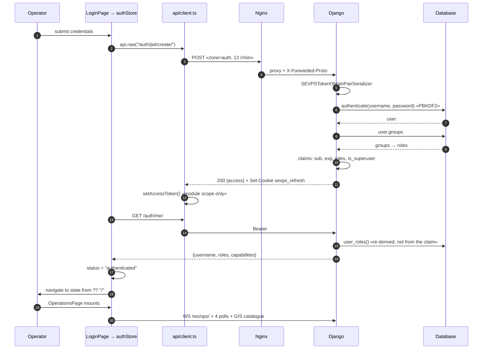
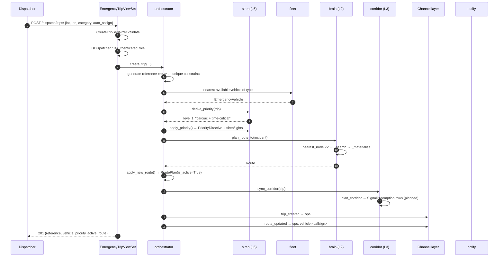
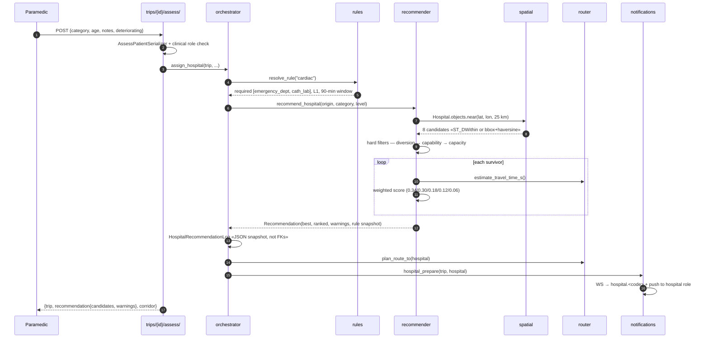
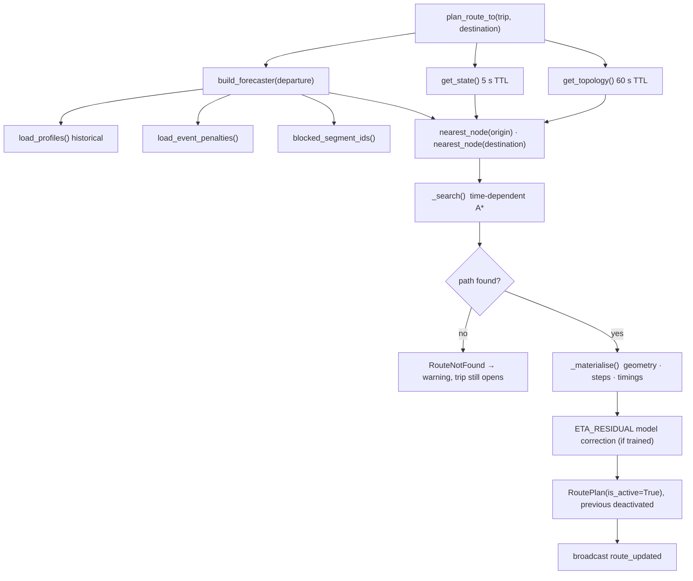
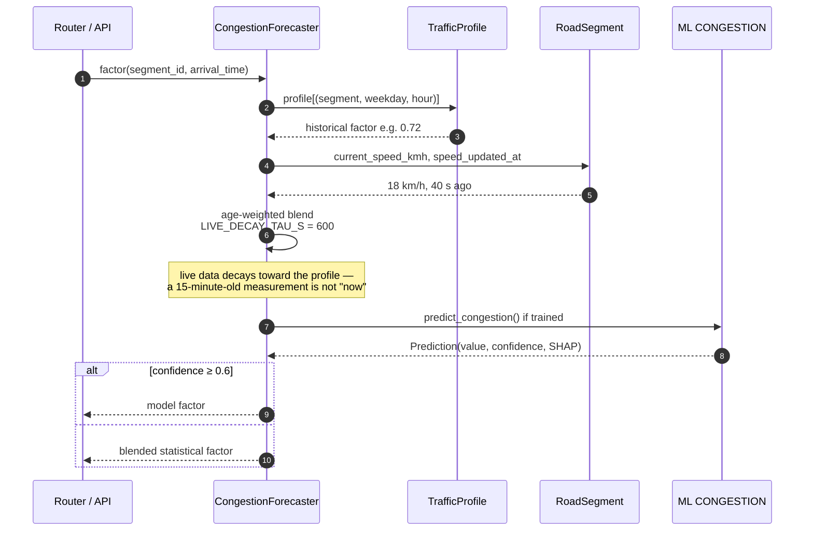
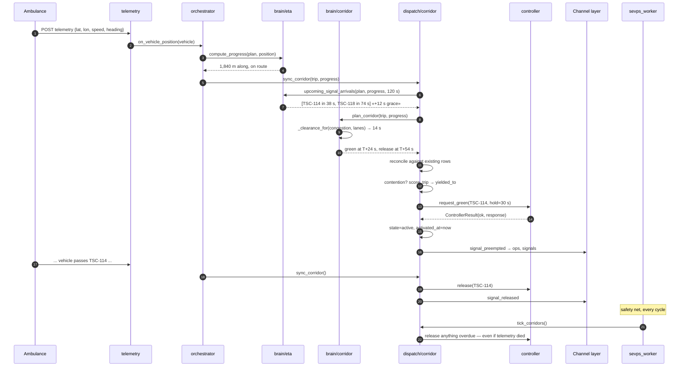
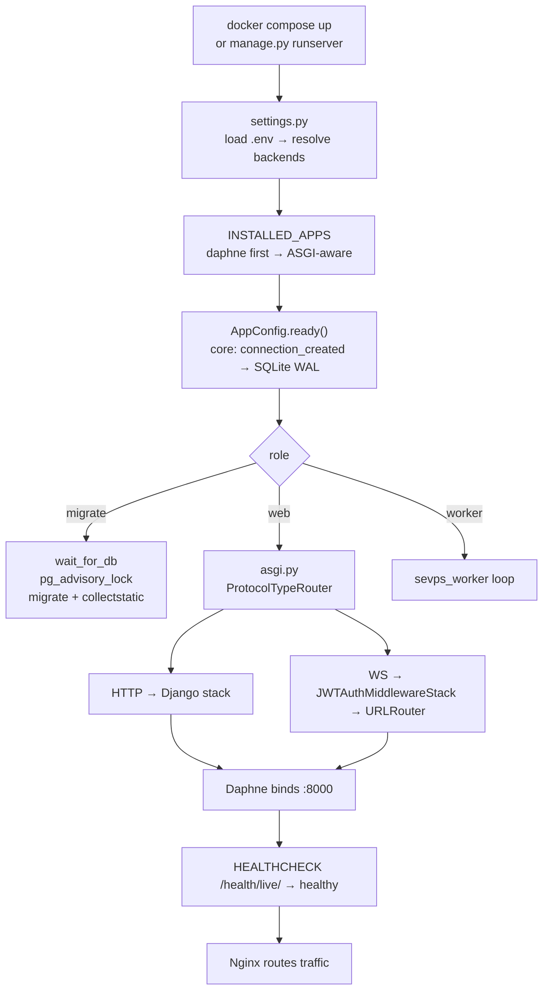
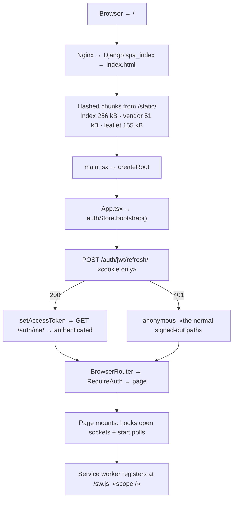
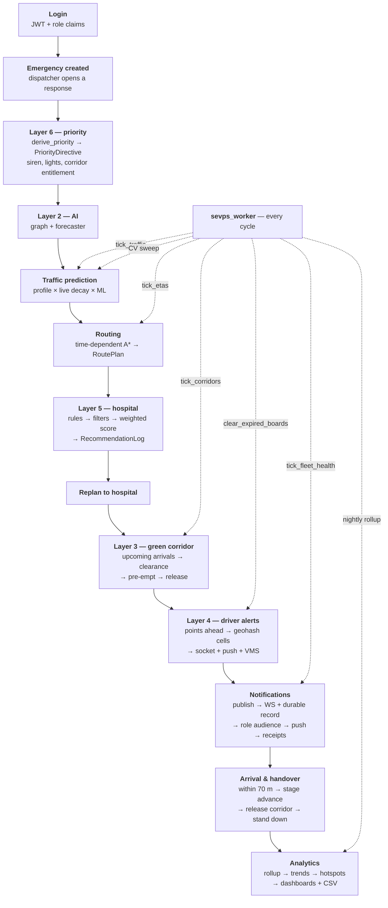

# Part 7 — Code Walkthrough · Request Flows · Execution Flow (§16–17, §23)

See [README.md](README.md) for the index.

## Contents

- [§16 Complete Code Walkthrough](#16-complete-code-walkthrough)
- [§17 Request Flows](#17-request-flows)
- [§23 Complete Execution Flow](#23-complete-execution-flow)

---

# §16 Complete Code Walkthrough

Major file by major file: what it does, how it works, why it exists, what it
touches, and how execution moves through it.

---

## 16.1 `manage.py` → `sevps/settings.py`

**Execution begins here for every process** — `runserver`, `migrate`,
`sevps_worker`, `pytest`.

`settings.py` reads `.env` via `load_dotenv`, then branches on three
environment variables that determine the entire runtime profile:

```python
DB_ENGINE = env("SEVPS_DB_ENGINE", "sqlite")      # sqlite | postgres
ENABLE_POSTGIS = env_bool("SEVPS_ENABLE_POSTGIS")  # generated columns + GiST
REDIS_URL = env("SEVPS_REDIS_URL", "")             # in-memory vs Redis
```

Three details that are easy to miss and expensive to get wrong:

- **`daphne` is first in `INSTALLED_APPS`.** That is what makes `runserver`
  ASGI-aware. Move it and WebSockets stop working in development while
  everything else keeps passing.
- **The `SEVPS` dict holds every domain tunable** — corridor lookahead, signal
  hold cap, alert radius, hospital weights, VAPID, CV mode. One place to look.
- **`if not DEBUG:` applies the whole security block.** HSTS, secure cookies,
  proxy header trust, and a hard `ImproperlyConfigured` if the development
  secret key survived into production.

**Interacts with:** everything. Read this file before changing behaviour that
looks hard-coded — it usually is not.

---

## 16.2 `apps/core/geo.py` — the foundation

**Zero dependencies.** Importable from a REPL, a test or a management command
with no Django setup.

**How the SQLite spatial path works, in two functions:**

```python
def bounding_box(lat, lon, radius_m):     # cheap, index-usable
def haversine_m(lat1, lon1, lat2, lon2):  # exact, expensive
```

`near_queryset()` filters by box first — which SQLite serves from the
`(latitude, longitude)` index — then applies haversine to what survives.
Without the prefilter, "hospitals within 25 km" is a full table scan and a
haversine call per row.

**`geohash(lat, lon, 6)` ≈ 1.2 km cells.** This is the driver-alert shard key.
`geohash_neighbours()` returns the surrounding eight, because a vehicle near a
cell boundary must warn both sides.

**Execution flows through it constantly:** every `.near()`, every route
materialisation, every driver alert, every position projection.

---

## 16.3 `apps/core/roles.py` + `permissions.py` — the authorisation spine

`roles.py` is a registry, not a set of constants. `RoleSpec` carries the three
capability flags, and the derived sets are computed from them:

```python
CLINICAL_ROLES = _roles_with("clinical_access")
OPERATIONAL_ROLES = frozenset(k for k in ROLES if k != Role.PUBLIC)
```

**Why derived rather than listed:** adding a role means filling in one
`RoleSpec`, and every derived set updates. Listing them separately guarantees
they drift.

`permissions.py` turns those sets into DRF classes. `BaseRolePermission`:

```python
def has_permission(self, request, view):
    if self.allow_safe_methods and request.method in SAFE_METHODS: return True
    if not (user and user.is_authenticated): return False
    if not self.required_roles: return True          # ← the historic bug
    return has_role(user, *self.required_roles)
```

That fourth line is where `public_users` used to slip through:
`IsAuthenticatedRole` had no `required_roles`, so "authenticated" meant
"authorised". It now declares `OPERATIONAL_ROLES`.

**Execution flows through it on every single request** — DRF calls
`has_permission` before the view body runs.

---

## 16.4 `apps/brain/graph.py` — the two-tier cache

```python
TOPOLOGY_TTL_S = 60.0   # nodes + edges: rarely change, expensive to build
STATE_TTL_S    = 5.0    # speeds + closures: constantly change, cheap
```

**Why two tiers rather than one.** Rebuilding the topology means loading every
`Intersection` and `RoadSegment` and constructing a `DiGraph` — hundreds of
milliseconds. Rebuilding live state means one query for changed speeds. At a
single TTL you either pay topology cost every five seconds or route on
minute-old congestion.

`get_topology()` and `get_state()` are the only accessors. `invalidate()` is
called after network edits (`/brain/network/rebuild/`).

**`nearest_node(lat, lon)`** snaps a coordinate onto the graph. Every route
request starts here, and it is why a request from a point 400 m off any road
still produces a route.

---

## 16.5 `apps/brain/router.py` — the search

The heart of Layer 2, and the place a new engineer should read first.

```python
def _search(topology, state, start, goal, request, forecaster):
    open_heap = [(heuristic(start), 0.0, start)]
    while open_heap:
        _, elapsed, node = heappop(open_heap)
        if node == goal: return reconstruct(...)
        for edge in topology.out_edges(node):
            if edge.segment_id in blocked: continue
            arrival = request.departure + timedelta(seconds=elapsed)
            factor  = forecaster.factor(edge.segment_id, arrival)   # ← the point
            speed   = edge.free_flow_kmh * factor * priority_multiplier
            cost    = edge.length_m / kmh_to_ms(speed)
            cost   += _signal_delay_s(request.priority_level, edge.base_delay_s)
            ...
```

**The one line that matters:** `factor` is evaluated at `arrival`, which is
`departure + elapsed`. That is time-dependency, and it is why
`networkx.astar_path` cannot be used — its weight callback receives
`(u, v, data)` and has no access to accumulated time.

**Priority changes the route, not just the speed.** A Level 1 vehicle gets a
speed multiplier and a reduced per-signal delay because it expects a green
corridor. The same origin/destination can therefore produce different paths at
different levels — correct, because a route that is only optimal if you get
green lights is the wrong route for a Level 4 transfer.

`MAX_EXPANSIONS = 250_000` bounds pathological searches. The alternative to a
bounded search is a request that never returns.

`_materialise()` converts the node path into geometry, turn-by-turn steps,
cumulative timings and a predicted ETA.

**Called from:** `orchestrator.plan_route_to`, `rerouting.evaluate_trip`,
`/brain/route/`.

---

## 16.6 `apps/dispatch/orchestrator.py` — the trip lifecycle

The busiest module in the platform. `on_vehicle_position()` runs once per
vehicle per second.

```python
def on_vehicle_position(vehicle):
    trip = vehicle.active_trip()
    if trip is None: return None                    # ← cheapest exit first

    plan = trip.active_route()
    progress = compute_progress(plan, vehicle.point())

    if progress.is_off_route:                       # ← replan
        return apply_new_route(trip, recompute(), reason="off route")

    arrival = _check_arrival(trip)                  # ← within 70 m?
    if arrival: return advance_stage(trip, arrival)

    corridor = sync_corridor(trip, progress)        # ← Layer 3
    alerts   = broadcast_driver_alerts(trip, progress)  # ← Layer 4
    broadcast_ops("eta_update", eta_for_trip(trip))
    return {...}
```

**Read the ordering as a cost gradient.** The cheapest check that can end the
call comes first. A vehicle with no active trip — most of the fleet, most of the
time — costs one query. Corridor sync and alert generation only run for vehicles
actually on a mission and actually on route.

`create_trip()` composes the whole platform in one function: allocate a vehicle,
derive priority (Layer 6), plan a route (Layer 2), open a corridor (Layer 3),
broadcast.

**Trip reference generation retries against the unique constraint** using
savepoints. A read-then-write `max(reference) + 1` raced under concurrent
dispatch and produced duplicates.

---

## 16.7 `apps/dispatch/corridor.py` — execution and the safety net

`sync_corridor()` reconciles the *plan* against *reality*:

```python
plan = plan_corridor(trip, progress)      # brain: what should be green, when
existing = trip.preemptions.exclude(state__in=TERMINAL)
# reconcile: create missing, update drifted, cancel obsolete
_activate_due(trip)      # send green commands whose time has come
_release_passed(trip)    # release junctions the vehicle has passed
```

**`plan_corridor` decides; `sync_corridor` executes.** That separation is why
`/brain/corridor/{trip_id}/preview/` can show the plan without committing to it.

`_resolve_conflict()` handles two ambulances converging on one junction:
`priority.score_trip` ranks them, the loser's pre-emption gets `yielded_to` set
and stands down. **Yielding is recorded as a relation, not a state** — reading
`state` alone files it as "cancelled", which renders in the analytics as a fault
when it is the contention rule working correctly.

**`tick_corridors()` is the safety net.** Run by `sevps_worker`, it releases
anything overdue *even if the trip stopped reporting*. If a vehicle's telemetry
dies mid-corridor, nothing else would ever release those junctions and cross
traffic would be held indefinitely.

---

## 16.8 `apps/hospitals/recommender.py` — the clinical decision

```python
def recommend_hospital(origin, category, priority_level, ...):
    rule = resolve_rule(category)
    candidates = Hospital.objects.near(origin.lat, origin.lon, radius)
    _apply_hard_filters(candidates, rule)      # diversion → capability → capacity
    survivors = [c for c in candidates if not c.excluded]
    if not survivors:
        survivors = _relax(candidates, {CAPABILITY}, "capability preferences relaxed")
    if not survivors:
        survivors = _relax(candidates, {CAPACITY}, "capacity constraint relaxed")
    for c in survivors: _score_candidate(c, rule, origin, priority_level)
    return Recommendation(best=max(survivors), candidates=ranked, warnings=...)
```

**Three properties worth preserving if you touch this:**

1. **Relaxation is tiered and never relaxes diversion.** Capability preferences
   first, then capacity, never diversion. A hospital that has declared it cannot
   receive a patient means it.
2. **Warnings survive relaxation.** An earlier version cleared them, so a
   relaxed recommendation looked like a clean one.
3. **`_score_candidate` is a weighted sum, not a model.** A clinician must be
   able to ask "why this hospital?" and get an answer they can argue with.

---

## 16.9 `apps/core/consumers.py` — `GroupConsumer`

```python
async def connect(self):
    self._groups = []                       # ← FIRST. A refusal must not crash disconnect()
    if not await self._authorise():
        return await self.close(code=4403)
    for group in self.policy.groups(self.scope):
        await self.channel_layer.group_add(group, self.channel_name)
        self._groups.append(group)
    await self.accept()
    await self._send_snapshot()
```

`_authorise()` wraps its role check in `database_sync_to_async` — reading
`user.groups` in an async context otherwise raises `SynchronousOnlyOperation`.

`sevps_event()` adds `seq` and `ts`, and applies coalescing:

```python
if event in COALESCED_EVENTS:
    key = data[COALESCED_EVENTS[event]]
    if now - self._last_sent.get(key, 0) < COALESCE_WINDOW_S: return
```

Twenty vehicles at 1 Hz would otherwise be 20 frames per second per dashboard.

---

## 16.10 `apps/core/notifications.py` → `apps/notify/service.py`

```python
def publish(notification):
    payload = notification.as_dict()
    broadcast_ops(EVENT, payload)                        # instant
    for group in notification.extra_groups: broadcast(...)
    try:
        from apps.notify.service import publish_and_deliver   # local import
        result = publish_and_deliver(payload)
        if result.record: payload["id"] = str(result.record.uuid)
    except Exception:
        log.warning(...)                                 # never raises
    return payload
```

**The local import and the bare `except` are both deliberate.** A deployment
without `apps.notify` still publishes; a broken push layer never aborts the
dispatch decision that raised the notification.

`publish_and_deliver` persists first, then resolves audience **by role at send
time**, then delivers per subscription with preference checks and receipts.

---

## 16.11 `frontend/src/api/client.ts` — single-flight refresh

```ts
async function request<T>(path, init) {
  let response = await fetch(path, withAuth(init));
  if (response.status === 401 && !isAuthEndpoint(path)) {
    if (await refresh()) response = await fetch(path, withAuth(init));
  }
  ...
}

function refresh(): Promise<boolean> {
  if (refreshInFlight) return refreshInFlight;      // ← the whole point
  refreshInFlight = doRefresh().finally(() => { refreshInFlight = null; });
  return refreshInFlight;
}
```

A dashboard runs four polls plus a socket. When the access token expires they
all 401 within milliseconds. Without the guard, five concurrent refreshes rotate
the token four times and four of them fail — the user is logged out mid-incident
by their own dashboard.

---

## 16.12 `frontend/src/pages/OperationsPage.tsx`

```tsx
const trips = useOpsStore(useShallow(selectTripList));
```

`selectTripList` builds a new array per call. Zustand 5 sits on
`useSyncExternalStore`, which compares snapshots with `Object.is`. Without
`useShallow` the component re-renders, the selector runs again, and the page
locks into an infinite loop rendering **blank**. Found by Playwright; the
constraint is now documented at the selector definition.

```tsx
usePolling((signal) => store.refreshVehicles(signal), 2000);   // floor
const { status, missedFrames } = useSocket("/ws/ops/", { onGap: resync, handlers });
```

Polling and socket run together, always. The socket is latency; the poll is
correctness.

---

## 16.13 `docker/entrypoint.sh` — role dispatch

```sh
case "$ROLE" in
  web)     wait_for_db; run_migrations; collect_static; exec daphne ... ;;
  worker)  wait_for_db;                                  exec python manage.py sevps_worker ;;
  migrate) wait_for_db; run_migrations; collect_static ;;
esac
```

**The worker deliberately does not migrate.** Exactly one role owns schema.

`run_migrations()` takes `pg_advisory_lock(87310219)` — Django has no internal
lock, and concurrent replicas can half-apply.

`ensure_vapid()` **warns rather than generating**. A key regenerated on every
container start would silently invalidate every push subscription in the fleet.

---

# §17 Request Flows

## 17.1 User login



**Failure paths:** bad credentials → 401, `.badge.bad`, stays on `/login`;
rate limit → 429; expired access token later → single-flight refresh; refresh
rejected → `authStore` → `anonymous` → guard redirects with `state.from`.

## 17.2 Emergency creation



**Errors:** 400 invalid category or missing coordinates; 409 no vehicle
available; 200 with a warning if the network cannot be routed (the trip still
opens — a dispatch decision must not fail because routing did).

## 17.3 Hospital recommendation



**The no-hospital case is an operational outcome, not an error.** 200 with
`hospital: null`, a warning, and a `no_hospital_available` notification to
dispatchers and administrators.

## 17.4 Route optimisation



**Reroute has hysteresis:**

```python
if gain_s < REROUTE_MIN_GAIN_S:                     # 45 s
    return RerouteDecision(should_reroute=False, reason="gain too small")
if seconds_since_last < REROUTE_MIN_INTERVAL_S:     # 30 s
    return RerouteDecision(should_reroute=False, reason="too soon")
```

Without both, the route thrashes on noise and the crew loses confidence in it —
at which point the routing is worse than useless because it is ignored.

## 17.5 Traffic prediction



**Live data decay is the key idea.** A speed measured 15 minutes ago is not
current traffic; treating it as such makes the router confidently wrong. The
exponential decay toward the historical profile means stale data gracefully
becomes "what this road is usually like at this hour".

## 17.6 Green corridor



**Failure path:** `ControllerResult(ok=False)` → `state=failed`,
`corridor_failed()` notification to traffic police and dispatchers, and the
junction stays on normal timing. The corridor degrades; it does not break.

---

# §23 Complete Execution Flow

From cold start to analytics, in order.

## 23.1 Startup sequence



**Ordering that matters:** `migrate` must complete before `web` or `worker`
start — `depends_on: {migrate: {condition: service_completed_successfully}}`.
The worker previously started when the web *container* did and crash-looped
querying tables that did not exist yet.

## 23.2 Database connection

First query triggers `connection_created`:

```python
PRAGMA journal_mode=WAL;        # concurrent readers during a write
PRAGMA synchronous=NORMAL;      # durability vs fsync latency
PRAGMA busy_timeout=20000;      # wait rather than fail
```

On PostgreSQL these are no-ops; `postgis_available()` probes once and caches, so
`.near()` resolves to `ST_DWithin` from then on.

## 23.3 Frontend initialisation



**The boot splash exists for the window between `bootstrap()` starting and
resolving.** Without it, guards see `status !== "authenticated"` and redirect —
every reload bounces an authenticated operator to `/login`.

## 23.4 The full operational chain



## 23.5 Timeline of one cardiac emergency

| T | Actor | What happens | Layer |
|---|---|---|---|
| 00:00 | Dispatcher | `POST /dispatch/trips/` — cardiac, coordinates | — |
| 00:00 | Orchestrator | Reference generated; AMB-01 allocated (nearest available) | 1 |
| 00:00 | Siren | Level 1 derived → `PriorityDirective`, siren wail, corridor granted | 6 |
| 00:01 | Router | Graph snapped, forecaster built, A* → 4.2 km / 8 min | 2 |
| 00:01 | Corridor | 6 junctions within the 120 s lookahead → planned rows | 3 |
| 00:01 | Sockets | `trip_created`, `route_updated` → ops + vehicle | — |
| 00:04 | Crew | Assessment: age 61, ST elevation | 5 |
| 00:04 | Recommender | Rule requires cath lab; 8 candidates → 3 survive → Apollo (0.87) | 5 |
| 00:04 | Notify | `hospital_prepare` → socket + push to hospital staff | — |
| 00:05 | Router | Replan to Apollo | 2 |
| 00:05→ | Telemetry | 1 Hz: progress → corridor sync → driver alerts → ETA | 1/3/4 |
| 03:12 | Corridor | TSC-114 activated 14 s before arrival | 3 |
| 03:12 | Alerts | Cells ahead warned, VMS boards updated | 4 |
| 03:26 | Corridor | TSC-114 released; hold recorded as cross-traffic cost | 3 |
| 04:40 | Contention | AMB-03 (Level 2) yields at TSC-118; `yielded_to` set | 3 |
| 08:31 | Orchestrator | Within 70 m of Apollo → stage `arrived` | — |
| 08:31 | Corridor | Full release; vehicle stands down | 3/6 |
| 09:14 | Crew | Handover → trip complete | — |
| 23:59 | Worker | `rollup_daily_metrics` materialises the day | 4.8 |
| next | Analytics | Response 3 m 12 s appears in the p90, the histogram and the trend | 4.8 |

## 23.6 The worker cycle

```python
while True:
    tick_corridors()          # release overdue holds — the safety net
    tick_etas()               # recompute + broadcast when > 15 s change
    tick_traffic()            # decay live speeds toward profiles
    tick_fleet_health()       # detect vehicles silent > 60 s
    clear_expired_boards()    # expire VMS messages
    if cv_due():  sweep()     # camera estate
    if midnight(): rollup_daily_metrics()
    sleep(SEVPS_SIM_TICK_SECONDS)
```

**Exactly one instance.** Two workers would both decide a junction should be
released and issue duplicate commands to real traffic infrastructure. Pinned at
`replicas: 1` in both compose files and asserted by a test.

---

**Previous:** [Part 6 — Realtime, Notifications, Dashboards](PART-6-REALTIME-NOTIFICATIONS-DASHBOARDS.md)
**Next:** [Part 8 — Deployment, Testing, Performance, Security](PART-8-DEPLOYMENT-TESTING-PERFORMANCE-SECURITY.md)
